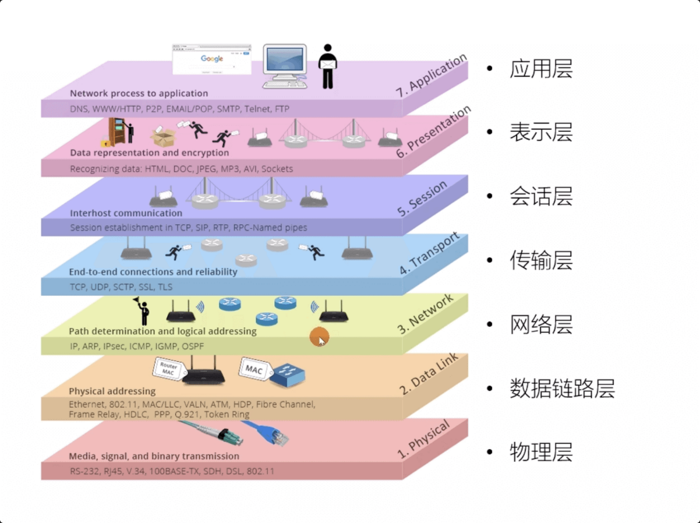
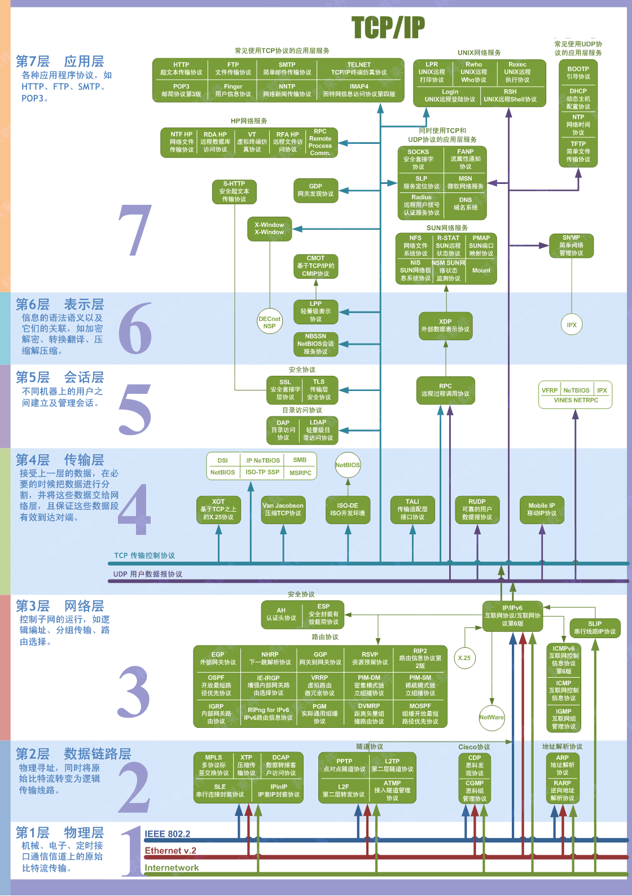
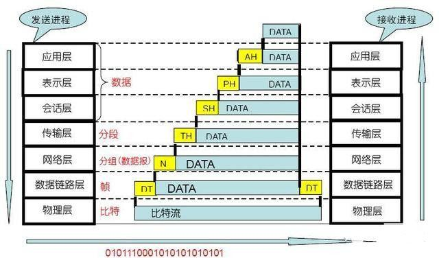
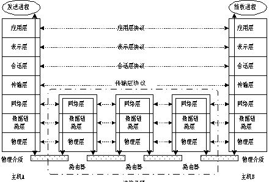
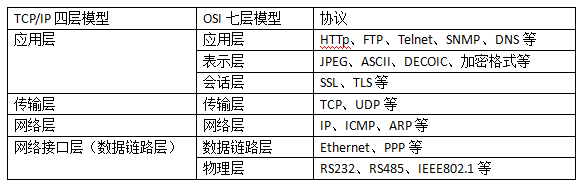

# OSI模型

[TOC]

# 一、什么是OSI模型

维基百科定义：

**开放式系统互联模型**（英语：**O**pen **S**ystems **I**nterconnection Model，缩写：OSI；简称为**OSI模型**）是一种[概念模型](https://zh.wikipedia.org/wiki/%E6%A6%82%E5%BF%B5%E6%A8%A1%E5%9E%8B)，由[国际标准化组织](https://zh.wikipedia.org/wiki/%E5%9B%BD%E9%99%85%E6%A0%87%E5%87%86%E5%8C%96%E7%BB%84%E7%BB%87)提出，一个试图使各种计算机在世界范围内互连为网络的标准框架。

该模型将通信系统中的数据流划分为七个层，从分布式应用程序数据的最高层表示到跨通信介质传输数据的物理实现。每个中间层为其上一层提供功能，其自身功能则由其下一层提供。功能的类别通过标准的通信协议在软件中实现。其中，第 1 到第 4 层与网络通信技术相关，而第 5 到第 7 层则与用户应用程序有关。

每一层都专注做一件事情，并且每一层都需要使用下一层提供的功能比如传输层需要使用网络层提供的路由和寻址功能，这样传输层才知道把数据传输到哪里去。

# 二、OSI七层模型

OSI定义了网络互连的七层模型（物理层、数据链路层、网络层、传输层、会话层、表示层、应用层），如下表：

| 层                            | 功能                                                         | 协议                                                         |
| ----------------------------- | ------------------------------------------------------------ | ------------------------------------------------------------ |
| 应用层（ Application Layer）  | 直接面向应用程序，提供网络服务接口                           | HTTP（超文本传输协议）、FTP（文件传输协议）、 SMTP （发邮件）、POP3/IMAP （收邮件）、DNS（域名系统）、DHCP（动态主机配置协议）、SNMP（简单网络管理协议）、Telnet（远程终端协议）、SSH（安全外壳协议）、IMAP4（互联网消息访问协议版本 4）、NFS（网络文件系统）、 LDAP（轻量目录访问协议） |
| 表示层（ Presentation Layer） | 数据处理（数据编码、加密解密、格式转换、压缩解压缩等）       | SSL（安全套接层）、TLS（传输层安全协议）、 ASCII（ 美国信息交换标准代码）、 JPEG（ 联合图像专家组（既指标准组织，也指对应的图像编码格式））、PNG（便携式网络图形）、GIF（图形交换格式） |
| 会话层（Session Layer）       | 管理（建立、维护、重连）应用程序之间的通信会话、 同步校验    | RPC（远程过程调用）、NETBIOS（网络基本输入输出系统）         |
| 传输层（Transport Layer）     | 为应用程序提供端到端的数据传输服务 ，负责数据的分段、传输控制、 差错重传、流量控制等 | TCP（传输控制协议）、UDP（用户数据报协议）、SCTP（流控制传输协议）、DCCP（数据报拥塞控制协议） |
| 网络层（Network Layer）       | 数据包的路由和转发，以及网络中的寻址和拥塞控制               | IP（互联网协议）、ICMP（互联网控制报文协议）、IGMP（互联网组管理协议）、RIP（路由信息协议）、OSPF（ 开放式最短路径优先） |
| 数据链路层（Data Link Layer） | 点对点的数据传输服务、负责将原始比特流转换为数据帧，帧校验， MAC 寻址 | Ethernet、PPP（点对点协议）、HDLC（高级数据链路控制）、WIFI（基于 IEEE 802.11 标准的无线局域网 WLAN）、ARP（地址解析协议）、VLAN（虚拟局域网）、MAC（ 介质访问控制地址 俗称物理地址） |
| 物理层（Physical Layer）      | 传输原始比特流， 定义电气 / 物理介质标准                     | RS232、RS485、光纤、双绞线                                   |

常见的通信协议及其作用

| 协议         | OSI 层级   | 核心作用       | 端口 / 标识 |
| ------------ | ---------- | -------------- | ----------- |
| HTTP         | 应用层     | 网页传输       | TCP 80      |
| HTTPS        | 应用层     | 加密网页       | TCP 443     |
| DNS          | 应用层     | 域名解析       | UDP 53      |
| DHCP         | 应用层     | 自动分配 IP    | UDP67/68    |
| SSH          | 应用层     | 安全远程登录   | TCP 22      |
| Telnet       | 应用层     | 明文远程登录   | TCP 23      |
| FTP          | 应用层     | 文件传输       | TCP21       |
| TCP          | 传输层     | 可靠传输       | -           |
| UDP          | 传输层     | 高速不可靠传输 | -           |
| IPv4         | 网络层     | IP 寻址转发    | -           |
| ICMP         | 网络层     | ping、网络探测 | 协议号 1    |
| ARP          | 网络层     | IP 转 MAC      | -           |
| OSPF         | 网络层     | 内网动态路由   | 协议号 89   |
| RIP          | 网络层     | 小型内网路由   | UDP520      |
| Ethernet     | 数据链路层 | 有线局域网     | MAC 寻址    |
| VLAN(802.1Q) | 数据链路层 | 隔离广播域     | -           |
| PPP          | 数据链路层 | 点对点链路     | 支持认证    |

OSI七层模型总结图：

OSI七层模型数据帧解析：

OSI 七层模型数据通信原理图：

# 三、TCP/IP 四层模型

它是把OSI七层模型简化成了五层模型。每一层都呼叫它的下一层所提供的网络来完成自己的需求

OSI 七层是理论模型，分得细；TCP/IP 四层是互联网实际模型，合并了上下两层。

> 参考链接：
>
> [OSI 七层模型与 TCP/IP 四层模型详解 | JavaGuide](https://javaguide.cn/cs-basics/network/osi-and-tcp-ip-model.html#%E7%BD%91%E7%BB%9C%E6%8E%A5%E5%8F%A3%E5%B1%82-network-interface-layer)

