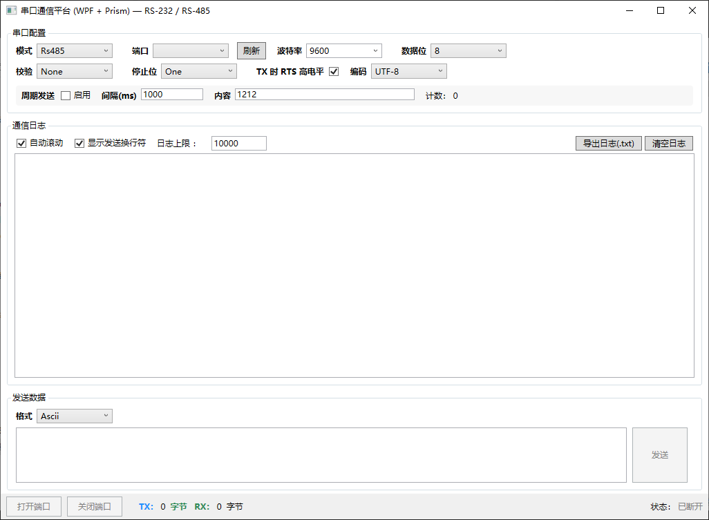

# 串口通信（UART）

[TOC]

# 一、什么是串口通信

串口通信的本质是一种**异步串行传输机制**。核心思想：**按位发送，靠约定同步**。

什么是**异步串行通信**：异步串行传输是一种“没有独上立时钟线”的数据发送方式，收发双方依靠**预先约定好的速率**（波特率）来解读每一位数据。

## **1.1 常见的串口通信**

**RS232和RS485是两种经典的串行通信接口标准，核心区别在于RS232是短距离、点对点的单端通信，而RS485是为长距离、工业环境设计的多节点差分通信。**

下面是它们的核心区别对比：

| 对比维度         | RS232                                               | RS485                                                        |
| ---------------- | --------------------------------------------------- | ------------------------------------------------------------ |
| **信号传输方式** | 单端信号（电压相对于地线）                          | **差分信号**（A、B两线间电压差），抗干扰能力极强             |
| **逻辑电平定义** | 逻辑"1"：-3V ~ -15V逻辑"0"：+3V ~ +15V              | 逻辑"1"：A线电压高于B线 (+2V ~ +6V)逻辑"0"：B线电压高于A线 (-2V ~ -6V) |
| **与TTL兼容性**  | **不兼容**，必须使用电平转换芯片（如MAX232）连接MCU | **兼容**，可直接连接TTL电路                                  |
| **最大传输距离** | **约15米**（标准值）                                | **约1200米**（标准值参考链接：[OSI 七层模型与 TCP/IP 四层模型详解 \| JavaGuide](https://javaguide.cn/cs-basics/network/osi-and-tcp-ip-model.html#%E7%BD%91%E7%BB%9C%E6%8E%A5%E5%8F%A3%E5%B1%82-network-interface-layer)，低速时可达3000米以上） |
| **通信模式**     | **全双工**，可同时收发数据                          | **半双工**，收发不能同时进行（也支持4线全双工，但应用较少）  |
| **节点连接数**   | **点对点（1:1）**，只能连接一台设备                 | **多点（1:N）**，一条总线最多可连接**32个**设备（可扩展至128个） |
| **典型应用场景** | 电脑连接调制解调器、调试串口、短距离外设            | 工业自动化、Modbus RTU现场总线、智能仪表、长距离数据采集     |

## **1.2 帧数据的组成**

异步传输不是连续不停地发，而是把数据打包成一个个小“帧”（Frame）。一帧典型的异步串行数据长这样（从左到右发送）：

| 空闲状态 (高电平) | **起始位 (1位)** | **数据位 (5~8位)** | **校验位 (可选)** | **停止位 (1/1.5/2位)** | 空闲状态 |
| ----------------- | ---------------- | ------------------ | ----------------- | ---------------------- | -------- |
|                   |                  |                    |                   |                        |          |

- **起始位 (Start Bit)**：**必须为低电平 (0)**。它表示“数据要来了”，用于校准接收方的时钟相位。
- **数据位 (Data Bits)**：真正要发送的数据（通常是低位在前）。比如发送字母`A`（ASCII码0x41），就逐位发出。
- **校验位 (Parity Bit)**：偶校验/奇校验，用于简单检错，可以不用（即N）。
- **停止位 (Stop Bit)**：**必须为高电平 (1)**。表示这帧数据结束，也给接收方一个准备接收下一帧的缓冲时间。

既然没有时钟线，双方怎么保证采样时机正确？靠的就是**波特率（Baud Rate）**，比如 9600bps。

- 发送方按每比特 `1/9600 ≈ 104微秒` 的速度逐个翻转电平。
- 接收方检测到**起始位的下降沿**后，内部计时器清零，然后每隔104微秒去采样一次电平。
- ⚠️：接收方通常会在每个比特的**中间位置**采样（比如等待52微秒后再采样），这样能最大程度避开电平跳变时的毛刺干扰，确保读数稳定。

## 1.3 串口数据特点

1. **纯字节流传输，无天然数据包边界**：串口底层只传输连续二进制字节，硬件和系统层不会区分数据帧，没有“一条报文”的概念，所有帧拆分、帧结束判断都需要上层协议自定义实现。
2. **天然存在粘包、断包问题（上位机核心难点）**：串口缓冲区会累积收发数据，大概率出现单次接收数据不完整（断包）、多条应答数据合并（粘包），必须手动维护接收缓冲区，通过帧头、帧尾、数据长度、校验码完成报文拼接与解析。
3. **被动轮询、一问一答通信机制**：主流Modbus-RTU串口协议为主机主动轮询模式，下位机不会主动上传数据，只有上位机下发请求指令后，设备才会返回应答数据，无主动上报机制。
4. **传输速率低、实时性有限**：常用波特率最高115200，传输带宽小，无法传输大量数据；且轮询串行执行，多设备通信存在排队延迟，仅适配低速工控设备、传感器、仪表等场景。
5. **无内置纠错、重传机制**：串口硬件本身不做数据校验、错误判断和丢包重传，传输干扰、丢包、错帧等问题，需要开发者通过CRC校验、超时判断、指令重发、异常过滤逻辑自主实现。
6. **半双工通信存在收发切换延时**：RS485串口同一时刻只能单方向通信，收发切换存在微小延时，上位机开发需适配延时逻辑，否则会出现发送完成后未及时切换接收状态，导致收不到设备应答的问题。
7. **数据传输时序依赖参数严格匹配**：波特率、数据位、校验位、停止位任意参数不匹配，会直接导致整帧数据乱码、解析失败，无兼容容错机制，收发设备参数必须完全统一。

## 1.4 上位机串口开发核心重点

上位机串口开发核心围绕**线程安全、串口生命周期、数据解析、异常容错、硬件适配** 五大关键点。

**1. 开发选型**

- **原生SerialPort**：零依赖、自由度高，需手动处理分包、线程、断线、异常，适合自定义协议。
- **HSL等工业库**：高度封装，自带Modbus解析、自动分包、断线重连、超时处理，适合快速工业项目开发。

**2. 线程安全（高频Bug点）**

- 串口接收事件 **DataReceived 属于子线程**，严禁直接操作UI控件，必须通过委托、Dispatcher、回调回显UI，否则程序闪退、报错。

**3. 串口生命周期规范**

- **程序**启动**打开一次串口常驻**，禁止频繁开关串口，避免COM口被锁、设备抖动、通信异常。
- 程序退出、异常崩溃必须手动Close释放串口资源。

**4. 数据处理核心规范**

- 必须自建**接收缓冲区**，手动拼接字节流，解决串口天然的粘包、断包问题。
- 所有接收数据**必须校验CRC**，禁止直接使用原始字节，防止工业干扰导致数据错误。
- 必须加**超时判断、指令重发、异常过滤**，弥补串口无内置重传纠错的缺陷。

**5. RS485硬件适配要点**

- 485设备必须**共地**，否则随机乱码、丢包、通信不稳定。
- 半双工模式需适配收发切换延时，避免发送后未切回接收，收不到下位机应答。

**6. 稳定性保障**

- 捕获串口占用、断开、热插拔异常，增加断线重连机制。
- 严格匹配两端波特率、数据位、校验位、停止位参数，参数不一致直接通信失败。

## 1.5 串口通信优缺点

**优点**：硬件简单、成本低、几乎所有工控设备都兼容、稳定可靠、适配老旧设备

**缺点**：速度慢、轮询机制实时性差、需要自己处理粘包、无内置重传、不适合大数据传输

# 二、串口通信的NET实现

技术栈：.NET 8 / WPF / Prism (DryIoc) / System.IO.Ports

## 2.1 目录组织结构

```c#
SerialCom/
├── Models/      # 纯数据模型与枚举（无逻辑依赖）
├── Services/    # 接口 + 实现（串口、设置持久化、工厂）
├── ViewModels/  # Prism MVVM 视图模型
├── Views/       # XAML 视图 + 代码后置（仅视图行为）
├── App.xaml.cs  # Prism 入口与 DI 注册
└── AssemblyInfo.cs
```

## 2.2 串口参数配置

```C#
/// <summary>
/// 串口参数配置。
/// </summary>
public class SerialConfig
{
    /// <summary>串口名称，例如 COM3</summary>
    public string PortName { get; set; } = "COM1";

    /// <summary>波特率</summary>
    public int BaudRate { get; set; } = 9600;

    /// <summary>数据位</summary>
    public int DataBits { get; set; } = 8;

    /// <summary>校验位</summary>
    public Parity Parity { get; set; } = Parity.None;

    /// <summary>停止位</summary>
    public StopBits StopBits { get; set; } = StopBits.One;

    /// <summary>握手方式</summary>
    public Handshake Handshake { get; set; } = Handshake.None;

    /// <summary>读超时（毫秒），-1 表示无限等待</summary>
    public int ReadTimeout { get; set; } = -1;

    /// <summary>写超时（毫秒），-1 表示无限等待</summary>
    public int WriteTimeout { get; set; } = -1;

    /// <summary>RS-485 模式下发送方向使能时的 RTS 状态（true=高电平驱动发送）</summary>
    public bool RtsHighWhenTransmitting { get; set; } = true;

    /// <summary>文本收发使用的编码；null 表示默认 ASCII。</summary>
    public Encoding? TextEncoding { get; set; }

    /// <summary>文本编码名称，用于序列化与持久化（等价于 Encoding.WebName）。</summary>
    public string TextEncodingName { get; set; } = "us-ascii";
}
```

## 2.3 串口服务接口和实现

```C#

/// <summary>
/// 串口通信服务统一抽象，支持 RS-232 与 RS-485。
/// </summary>
public interface ISerialService : IDisposable
{
    /// <summary>当前通信模式</summary>
    CommunicationMode Mode { get; }

    /// <summary>是否已打开</summary>
    bool IsOpen { get; }

    /// <summary>参数变更时触发</summary>
    event EventHandler? StateChanged;

    /// <summary>收到一帧数据时触发（在串口工作线程上触发，订阅者需自行切换到 UI 线程）</summary>
    event EventHandler<DataReceivedEventArgs>? DataReceived;

    /// <summary>发生错误时触发</summary>
    event EventHandler<ErrorEventArgs>? ErrorOccurred;

    /// <summary>使用给定配置打开串口</summary>
    void Open(SerialConfig config);

    /// <summary>关闭串口</summary>
    void Close();

    /// <summary>
    /// 异步发送字节。实现必须保证调用线程不被阻塞（内部卸载到后台线程），
    /// 可安全在 UI 线程调用；RS-485 的方向切换等待由实现方在后台完成。
    /// 并发调用由实现方串行化，返回实际写入的字节数。
    /// </summary>
    Task<int> SendAsync(byte[] data, CancellationToken cancellationToken = default);

    /// <summary>获取可用串口名列表</summary>
    string[] GetAvailablePorts();
}

/// <summary>
/// 接收数据事件参数。
/// </summary>
public class DataReceivedEventArgs : EventArgs
{
    public byte[] Data { get; }

    public DataReceivedEventArgs(byte[] data)
    {
        Data = data;
    }
}

/// <summary>
/// 错误事件参数。
/// </summary>
public class ErrorEventArgs : EventArgs
{
    public string Message { get; }

    public ErrorEventArgs(string message)
    {
        Message = message;
    }
}

/// <summary>
/// 串口服务基类，封装 System.IO.Ports.SerialPort 的通用逻辑。
/// 子类通过重写 <see cref="ApplyPortSettings"/> 与 <see cref="WriteBytesCoreAsync"/> 实现 RS-232 / RS-485 差异。
/// </summary>
public abstract class SerialServiceBase : ISerialService
{
    private SerialPort? _port;
    private bool _disposed;
    private long _bytesSent;
    private long _bytesReceived;

    /// <summary>
    /// 发送串行锁：RS-485 的 RTS 方向翻转绝不能并发交错，
    /// 手动发送 / 周期发送同时触发时在此排队。
    /// </summary>
    private readonly SemaphoreSlim _writeLock = new(1, 1);

    public abstract CommunicationMode Mode { get; }

    public bool IsOpen => _port?.IsOpen ?? false;

    /// <summary>累计发送字节数，线程安全。</summary>
    public long BytesSent => _bytesSent;

    /// <summary>累计接收字节数，线程安全。</summary>
    public long BytesReceived => _bytesReceived;

    /// <summary>当前打开时使用的配置，子类在 Open/Write 时可访问。</summary>
    protected SerialConfig? CurrentConfig { get; private set; }

    public event EventHandler? StateChanged;
    public event EventHandler<DataReceivedEventArgs>? DataReceived;
    public event EventHandler<ErrorEventArgs>? ErrorOccurred;

    public void Open(SerialConfig config)
    {
        if (IsOpen)
        {
            Close();
        }

        try
        {
            CurrentConfig = config;
            _port = new SerialPort
            {
                PortName = config.PortName,
                BaudRate = config.BaudRate,
                DataBits = config.DataBits,
                Parity = config.Parity,
                StopBits = config.StopBits,
                Handshake = config.Handshake,
                ReadTimeout = config.ReadTimeout,
                WriteTimeout = config.WriteTimeout,
                Encoding = config.TextEncoding ?? Encoding.ASCII
            };

            // 让子类应用特定模式设置（如 RS-485 的 RTS）
            ApplyPortSettings(_port, config);

            _port.DataReceived += OnSerialDataReceived;
            _port.ErrorReceived += OnSerialErrorReceived;

            _port.Open();
            _bytesSent = 0;
            _bytesReceived = 0;

            OnStateChanged();
        }
        catch (Exception ex)
        {
            RaiseError("打开串口失败：" + GetFriendlyMessage(ex));
            _port?.Dispose();
            _port = null;
            CurrentConfig = null;
            throw new InvalidOperationException(GetFriendlyMessage(ex), ex);
        }
    }

    public void Close()
    {
        if (_port == null)
        {
            return;
        }

        try
        {
            if (_port.IsOpen)
            {
                _port.DataReceived -= OnSerialDataReceived;
                _port.ErrorReceived -= OnSerialErrorReceived;
                _port.Close();
            }
        }
        catch (Exception ex)
        {
            RaiseError("关闭串口失败：" + GetFriendlyMessage(ex));
        }
        finally
        {
            _port.Dispose();
            _port = null;
            CurrentConfig = null;
            OnStateChanged();
        }
    }

    /// <summary>
    /// 异步发送：把 <see cref="WriteBytesCoreAsync"/>（含 RS-485 的等待逻辑）卸载到线程池执行，
    /// 绝不阻塞调用线程，可安全在 UI 线程 await；
    /// 并发调用通过 <see cref="_writeLock"/> 串行化，保证 RTS 方向翻转不交错。
    /// </summary>
    public async Task<int> SendAsync(byte[] data, CancellationToken cancellationToken = default)
    {
        if (!IsOpen || _port == null)
        {
            throw new InvalidOperationException("串口未打开");
        }
        if (data == null || data.Length == 0)
        {
            return 0;
        }

        await _writeLock.WaitAsync(cancellationToken).ConfigureAwait(false);
        try
        {
            // 发送核心（含 RS-485 的等待逻辑）必须离开调用线程执行，
            // 否则低波特率 + 大数据包时会把 UI 卡死数秒
            int sent = await Task.Run(() => WriteBytesCoreAsync(_port, data, cancellationToken), cancellationToken)
                                 .ConfigureAwait(false);
            Interlocked.Add(ref _bytesSent, sent);
            return sent;
        }
        catch (OperationCanceledException)
        {
            RaiseError("发送已取消");
            throw;
        }
        catch (Exception ex)
        {
            RaiseError("发送失败：" + GetFriendlyMessage(ex));
            throw new InvalidOperationException(GetFriendlyMessage(ex), ex);
        }
        finally
        {
            _writeLock.Release();
        }
    }

    public string[] GetAvailablePorts()
    {
        try
        {
            return SerialPort.GetPortNames();
        }
        catch
        {
            return Array.Empty<string>();
        }
    }

    /// <summary>子类应用模式特定的端口设置。</summary>
    protected virtual void ApplyPortSettings(SerialPort port, SerialConfig config)
    {
        // 默认不做事
    }

    /// <summary>
    /// 子类实现具体写入逻辑。RS-232 直接写，RS-485 需要在写入前后切换 RTS 控制总线方向。
    /// 该方法始终在线程池上执行（由 <see cref="SendAsync"/> 卸载），
    /// 实现内的等待必须使用 Task.Delay 等异步方式，禁止 Thread.Sleep。
    /// 返回实际写入的字节数。
    /// </summary>
    protected abstract Task<int> WriteBytesCoreAsync(SerialPort port, byte[] data, CancellationToken cancellationToken);

    protected void OnStateChanged() => StateChanged?.Invoke(this, EventArgs.Empty);

    protected void RaiseError(string message) => ErrorOccurred?.Invoke(this, new ErrorEventArgs(message));

    private void OnSerialDataReceived(object sender, SerialDataReceivedEventArgs e)
    {
        if (_port == null || !_port.IsOpen)
        {
            return;
        }

        try
        {
            // 先休眠一小段时间，确保一帧数据尽量完整地到达缓冲区
            // 注意：DataReceived 触发不保证一次一帧，这里仅做尽力而为
            int bytesToRead = _port.BytesToRead;
            if (bytesToRead <= 0)
            {
                return;
            }

            var buffer = new byte[bytesToRead];
            int read = _port.Read(buffer, 0, bytesToRead);
            if (read > 0)
            {
                if (read < buffer.Length)
                {
                    Array.Resize(ref buffer, read);
                }
                System.Threading.Interlocked.Add(ref _bytesReceived, read);
                DataReceived?.Invoke(this, new DataReceivedEventArgs(buffer));
            }
        }
        catch (Exception ex)
        {
            // IOException 通常表示设备已拔出 / 串口失效
            if (ex is IOException)
            {
                RaiseError("串口异常：设备可能已被拔出或失连，已自动关闭。");
                try
                {
                    Close();
                }
                catch { /* 忽略二次异常 */ }
                return;
            }
            RaiseError("读取数据失败：" + GetFriendlyMessage(ex));
        }
    }

    private void OnSerialErrorReceived(object sender, SerialErrorReceivedEventArgs e)
    {
        var friendly = e.EventType switch
        {
            SerialError.RXOver => "接收缓冲区溢出，数据可能丢失（考虑降低波特率或加快读取）",
            SerialError.Overrun => "硬件缓冲区溢出，数据丢失",
            SerialError.RXParity => "奇偶校验错误",
            SerialError.Frame => "帧错误（波特率/校验/停止位不匹配）",
            SerialError.TXFull => "发送缓冲区已满",
            _ => e.EventType.ToString()
        };
        RaiseError("串口错误：" + friendly);
    }

    /// <summary>
    /// 将 I/O / 端口相关异常翻译为中文友好提示。
    /// </summary>
    protected static string GetFriendlyMessage(Exception ex)
    {
        if (ex == null) return string.Empty;
        if (ex is UnauthorizedAccessException)
            return "端口被占用（已被其他程序打开），请先关闭其他串口软件再重试";
        if (ex is System.IO.FileNotFoundException)
            return "指定的串口不存在（可能设备已拔出或名称错误）";
        if (ex is System.IO.IOException)
            return "I/O 错误（可能设备断开或驱动异常）：" + ex.Message;
        if (ex is ArgumentOutOfRangeException)
            return "参数无效：" + ex.Message;
        if (ex is InvalidOperationException)
            return ex.Message;
        if (ex is TimeoutException)
            return "操作超时";
        return ex.Message;
    }

    public void Dispose()
    {
        if (_disposed)
        {
            return;
        }
        _disposed = true;
        Close();
        _writeLock.Dispose();
    }
}
```

## 2.4 工厂方法的方式创建Rs232和Rs485串口服务

```C#
/// <summary>
/// 串口服务工厂：根据通信模式创建对应实现。
/// 由于每次切换模式需重新创建实例，工厂方法返回新实例。
/// </summary>
public interface ISerialServiceFactory
{
    /// <summary>按指定通信模式创建一个串口服务实例。</summary>
    ISerialService Create(CommunicationMode mode);
}

/// <summary>
/// 默认工厂实现，直接 new 出 RS-232 / RS-485 服务实例。
/// </summary>
public class SerialServiceFactory : ISerialServiceFactory
{
    public ISerialService Create(CommunicationMode mode)
    {
        return mode switch
        {
            CommunicationMode.Rs232 => new Rs232Service(),
            CommunicationMode.Rs485 => new Rs485Service(),
            _ => new Rs232Service()
        };
    }
}
/// <summary>
/// RS-232 全双工服务。直接通过 SerialPort 读写，无需方向控制。
/// </summary>
public class Rs232Service : SerialServiceBase
{
    public override CommunicationMode Mode => CommunicationMode.Rs232;

    protected override Task<int> WriteBytesCoreAsync(SerialPort port, byte[] data, CancellationToken cancellationToken)
    {
        port.Write(data, 0, data.Length);
        return Task.FromResult(data.Length);
    }
}

/// <summary>
/// RS-485 半双工服务。通过手动控制 RTS 切换总线方向：
///   发送前置 RTS 为发送使能电平，发送完后再置回接收状态。
/// 注意：不同 RS-485 收发器（如 MAX485）的方向控制电平可能不同，
///       可通过 <see cref="SerialConfig.RtsHighWhenTransmitting"/> 指定发送时 RTS 是否为高电平。
/// </summary>
public class Rs485Service : SerialServiceBase
{
    public override CommunicationMode Mode => CommunicationMode.Rs485;

    protected override void ApplyPortSettings(SerialPort port, SerialConfig config)
    {
        // RS-485 通常需要手动控制 RTS，所以强制关闭硬件握手
        port.Handshake = Handshake.None;
        port.RtsEnable = false; // 默认处于接收状态
    }

    /// <summary>
    /// RS-485 写入：先切换 RTS 到发送方向，写完并等待硬件 FIFO 清空后再切回接收方向。
    /// 本方法由基类 SendAsync 卸载到线程池执行；内部等待全部用 Task.Delay 异步完成，
    /// 不占用线程，也不会阻塞 UI。
    /// </summary>
    protected override async Task<int> WriteBytesCoreAsync(SerialPort port, byte[] data, CancellationToken cancellationToken)
    {
        var config = CurrentConfig;
        bool txHigh = config?.RtsHighWhenTransmitting ?? true;

        // 1) 切换到发送方向
        cancellationToken.ThrowIfCancellationRequested();
        port.RtsEnable = txHigh;
        // 给收发器方向切换留出稳定时间（典型 50~200us，这里保守 1ms）
        await Task.Delay(1, cancellationToken).ConfigureAwait(false);

        // 2) 写入数据
        //    注意：SerialPort.BaseStream.Flush() 在 .NET Core / .NET 5+ 中是空实现（no-op），
        //    因此我们依赖 Write 返回后再轮询 BytesToWrite==0 来等待硬件 FIFO 清空。
        port.Write(data, 0, data.Length);

        // 3) 等待最后字节真正移出硬件发送 FIFO，再切回接收方向
        await WaitForWriteBufferEmptyAsync(port, data.Length, cancellationToken).ConfigureAwait(false);
        port.RtsEnable = !txHigh;

        return data.Length;
    }

    /// <summary>
    /// 异步等待串口发送缓冲区数据物理发送完成。
    /// 兼容 USB 转串口芯片 BytesToWrite 无效问题：轮询失败时按波特率估算兜底。
    /// </summary>
    /// <param name="port">串口实例</param>
    /// <param name="byteCount">本次发送字节数</param>
    /// <param name="cancellationToken">取消令牌（用于串口关闭/退出时快速结束）</param>
    private static async Task WaitForWriteBufferEmptyAsync(SerialPort port, int byteCount, CancellationToken cancellationToken)
    {
        int baud = port.BaudRate > 0 ? port.BaudRate : 9600;
        // 1起始位 + 8数据位 + 1停止位，每字节10bit
        int perByteUs = (int)(10.0 / baud * 1_000_000);
        int totalEstimateUs = (perByteUs * byteCount) + 500; // +500us 保守缓冲

        // 方案A：轮询 BytesToWrite（部分 USB 转串口芯片驱动可能始终为 0，需双保险）
        int maxPollLoops = Math.Max(20, byteCount * 2);
        int polled = 0;
        while (polled < maxPollLoops && !cancellationToken.IsCancellationRequested)
        {
            try
            {
                if (port.BytesToWrite == 0)
                {
                    // 缓冲区空后，额外等待一半预估时间，保证最后 bit 送出
                    int tailSleepMs = Math.Max(1, ((totalEstimateUs / 2) + 999) / 1000);
                    await Task.Delay(tailSleepMs, cancellationToken).ConfigureAwait(false);
                    return;
                }
            }
            catch
            {
                // 读取 BytesToWrite 异常（串口断开等），跳出轮询进入兜底延时
                break;
            }
            await Task.Delay(1, cancellationToken).ConfigureAwait(false);
            polled++;
        }

        // 方案B：波特率估算兜底延时
        int delayMs = (totalEstimateUs + 999) / 1000;
        if (delayMs < 1) delayMs = 1;
        await Task.Delay(delayMs, cancellationToken).ConfigureAwait(false);
    }
}

```

## 2.5 AppSettings 的实现

```C#
/// <summary>
/// 应用级设置，可序列化到 JSON 文件。
/// </summary>
public class AppSettings
{
    // --- 串口配置 ---
    public CommunicationMode Mode { get; set; } = CommunicationMode.Rs232;
    public string PortName { get; set; } = string.Empty;
    public int BaudRate { get; set; } = 9600;
    public int DataBits { get; set; } = 8;

    [JsonConverter(typeof(JsonStringEnumConverter))]
    public Parity Parity { get; set; } = Parity.None;

    [JsonConverter(typeof(JsonStringEnumConverter))]
    public StopBits StopBits { get; set; } = StopBits.One;

    [JsonConverter(typeof(JsonStringEnumConverter))]
    public Handshake Handshake { get; set; } = Handshake.None;

    public bool RtsHighWhenTransmitting { get; set; } = true;

    // --- 显示/发送格式 ---
    [JsonConverter(typeof(JsonStringEnumConverter))]
    public DataFormat DataFormat { get; set; } = DataFormat.Ascii;

    public string TextEncodingName { get; set; } = "us-ascii";
    public bool AppendNewLineOnSend { get; set; } = true;
    public bool AutoScrollLog { get; set; } = true;

    // --- 周期发送 ---
    public bool AutoSendEnabled { get; set; } = false;
    public int AutoSendIntervalMs { get; set; } = 1000;
    public string AutoSendText { get; set; } = string.Empty;

    // --- UI ---
    public double LogMaxLines { get; set; } = 10000;
}

/// <summary>
/// 负责加载/保存 AppSettings 到本地文件（用户 AppData 目录）。
/// </summary>
public interface ISettingsService
{
    /// <summary>从磁盘加载，找不到或出错则返回默认值。</summary>
    AppSettings Load();

    /// <summary>保存到磁盘。</summary>
    void Save(AppSettings settings);
}

public class SettingsService : ISettingsService
{
    private static readonly string SettingsDir = Path.Combine(
        Environment.GetFolderPath(Environment.SpecialFolder.ApplicationData),
        "SerialCom");

    private static readonly string SettingsPath = Path.Combine(SettingsDir, "settings.json");

    public AppSettings Load()
    {
        try
        {
            if (File.Exists(SettingsPath))
            {
                var json = File.ReadAllText(SettingsPath, Encoding.UTF8);
                var s = JsonSerializer.Deserialize<AppSettings>(json);
                if (s != null) return s;
            }
        }
        catch
        {
            // 解析失败 -> 使用默认值
        }
        return new AppSettings();
    }

    public void Save(AppSettings settings)
    {
        try
        {
            if (!Directory.Exists(SettingsDir))
            {
                Directory.CreateDirectory(SettingsDir);
            }
            var json = JsonSerializer.Serialize(settings, new JsonSerializerOptions
            {
                WriteIndented = true
            });
            File.WriteAllText(SettingsPath, json, Encoding.UTF8);
        }
        catch
        {
            // 保存失败静默，至少不让程序崩
        }
    }
}
```

## 2.6 MainWindowViewModel的实现

```C#
/// <summary>
/// 主窗口视图模型：负责串口配置、收发控制与日志展示。
/// </summary>
public class MainWindowViewModel : BindableBase, IDisposable
{
    private readonly ISerialServiceFactory _factory;
    private readonly ISettingsService _settings;

    private ISerialService? _service;
    private bool _isOpen;
    private string _sendText = string.Empty;
    private long _txCount;
    private long _rxCount;
    private bool _autoScrollLog = true;
    private int _logMaxLines = 10000;

    // 选中项
    private string? _selectedPort;
    private int _selectedBaudRate = 9600;
    private int _selectedDataBits = 8;
    private Parity _selectedParity = Parity.None;
    private StopBits _selectedStopBits = StopBits.One;
    private Handshake _selectedHandshake = Handshake.None;
    private CommunicationMode _selectedMode = CommunicationMode.Rs232;
    private DataFormat _selectedFormat = DataFormat.Ascii;
    private string _selectedEncoding = "us-ascii";
    private bool _rtsHighWhenTransmitting = true;
    private bool _appendNewLineOnSend = true;

    // 周期发送
    private bool _autoSendEnabled;
    private int _autoSendIntervalMs = 1000;
    private string _autoSendText = string.Empty;
    private DispatcherTimer? _autoSendTimer;
    private long _autoSendCounter;

    // 周期发送防重入：上一轮尚未完成时跳过本轮 Tick（发送间隔可能短于实际发送耗时）
    private int _autoSendInFlight;

    // ASCII 模式接收端的跨包解码器（解决多字节字符被 DataReceived 事件切成两半导致的半字乱码）
    private Decoder? _rxDecoder;
    private readonly object _rxDecoderLock = new();

    public MainWindowViewModel(ISerialServiceFactory factory, ISettingsService settings)
    {
        _factory = factory;
        _settings = settings;

        RefreshPortsCommand = new DelegateCommand(RefreshPorts);
        OpenPortCommand = new DelegateCommand(OpenPort, () => !IsOpen && !string.IsNullOrEmpty(SelectedPort))
            .ObservesProperty(() => IsOpen)
            .ObservesProperty(() => SelectedPort);
        ClosePortCommand = new DelegateCommand(ClosePort, () => IsOpen)
            .ObservesProperty(() => IsOpen);
        SendCommand = new DelegateCommand(SendData, () => IsOpen && !string.IsNullOrEmpty(SendText))
            .ObservesProperty(() => IsOpen)
            .ObservesProperty(() => SendText);
        ClearLogCommand = new DelegateCommand(() => Log.Clear());
        ExportLogCommand = new DelegateCommand(ExportLog);

        BaudRates = new[] { 1200, 2400, 4800, 9600, 19200, 38400, 57600, 115200, 230400, 460800, 921600 };
        DataBitsOptions = new[] { 5, 6, 7, 8 };
        ParityOptions = new[] { Parity.None, Parity.Odd, Parity.Even, Parity.Mark, Parity.Space };
        StopBitsOptions = new[] { StopBits.One, StopBits.OnePointFive, StopBits.Two };
        HandshakeOptions = new[] { Handshake.None, Handshake.RequestToSend, Handshake.RequestToSendXOnXOff, Handshake.XOnXOff };
        ModeOptions = new[] { CommunicationMode.Rs232, CommunicationMode.Rs485 };
        FormatOptions = new[] { DataFormat.Ascii, DataFormat.Hex };
        EncodingOptions = new[]
        {
            new EncodingOption("ASCII", "us-ascii"),
            new EncodingOption("UTF-8", "utf-8"),
            new EncodingOption("GB2312 / 中文", "gb2312"),
            new EncodingOption("Latin-1 / ISO-8859-1", "iso-8859-1")
        };

        LoadSettings();
        RefreshPorts();
    }

    #region 选项集合

    public ObservableCollection<string> AvailablePorts { get; } = new();
    public int[] BaudRates { get; }
    public int[] DataBitsOptions { get; }
    public Parity[] ParityOptions { get; }
    public StopBits[] StopBitsOptions { get; }
    public Handshake[] HandshakeOptions { get; }
    public CommunicationMode[] ModeOptions { get; }
    public DataFormat[] FormatOptions { get; }
    public EncodingOption[] EncodingOptions { get; }

    #endregion

    #region 选中项

    public string? SelectedPort
    {
        get => _selectedPort;
        set => SetProperty(ref _selectedPort, value);
    }

    public int SelectedBaudRate
    {
        get => _selectedBaudRate;
        set => SetProperty(ref _selectedBaudRate, value);
    }

    public int SelectedDataBits
    {
        get => _selectedDataBits;
        set => SetProperty(ref _selectedDataBits, value);
    }

    public Parity SelectedParity
    {
        get => _selectedParity;
        set => SetProperty(ref _selectedParity, value);
    }

    public StopBits SelectedStopBits
    {
        get => _selectedStopBits;
        set => SetProperty(ref _selectedStopBits, value);
    }

    public Handshake SelectedHandshake
    {
        get => _selectedHandshake;
        set => SetProperty(ref _selectedHandshake, value);
    }

    public CommunicationMode SelectedMode
    {
        get => _selectedMode;
        set
        {
            if (SetProperty(ref _selectedMode, value))
            {
                RaisePropertyChanged(nameof(IsRs485));
                RaisePropertyChanged(nameof(CanEditHandshake));
            }
        }
    }

    public DataFormat SelectedFormat
    {
        get => _selectedFormat;
        set => SetProperty(ref _selectedFormat, value);
    }

    public string SelectedEncoding
    {
        get => _selectedEncoding;
        set => SetProperty(ref _selectedEncoding, value);
    }

    public bool RtsHighWhenTransmitting
    {
        get => _rtsHighWhenTransmitting;
        set => SetProperty(ref _rtsHighWhenTransmitting, value);
    }

    /// <summary>RS-485 才显示 RTS 极性选项。</summary>
    public bool IsRs485 => SelectedMode == CommunicationMode.Rs485;

    /// <summary>RS-485 模式下禁用硬件握手（由 RTS 手动控制方向）。</summary>
    public bool CanEditHandshake => SelectedMode != CommunicationMode.Rs485;

    public bool AppendNewLineOnSend
    {
        get => _appendNewLineOnSend;
        set => SetProperty(ref _appendNewLineOnSend, value);
    }

    public bool AutoScrollLog
    {
        get => _autoScrollLog;
        set => SetProperty(ref _autoScrollLog, value);
    }

    public int LogMaxLines
    {
        get => _logMaxLines;
        set => SetProperty(ref _logMaxLines, value);
    }

    // --- 周期发送 ---
    public bool AutoSendEnabled
    {
        get => _autoSendEnabled;
        set
        {
            if (SetProperty(ref _autoSendEnabled, value))
            {
                if (value) StartAutoSendTimer();
                else StopAutoSendTimer();
            }
        }
    }

    public int AutoSendIntervalMs
    {
        get => _autoSendIntervalMs;
        set
        {
            if (value < 1) value = 1;
            if (SetProperty(ref _autoSendIntervalMs, value) && _autoSendTimer != null)
            {
                _autoSendTimer.Interval = TimeSpan.FromMilliseconds(value);
            }
        }
    }

    public string AutoSendText
    {
        get => _autoSendText;
        set => SetProperty(ref _autoSendText, value);
    }

    public long AutoSendCounter
    {
        get => _autoSendCounter;
        private set => SetProperty(ref _autoSendCounter, value);
    }

    #endregion

    #region 状态与数据

    public bool IsOpen
    {
        get => _isOpen;
        private set
        {
            if (SetProperty(ref _isOpen, value))
            {
                RaisePropertyChanged(nameof(IsClosed));
                if (!value) StopAutoSendTimer();
            }
        }
    }

    public bool IsClosed => !IsOpen;

    public string SendText
    {
        get => _sendText;
        set => SetProperty(ref _sendText, value);
    }

    public ObservableCollection<LogEntry> Log { get; } = new();

    public long TxCount
    {
        get => _txCount;
        private set => SetProperty(ref _txCount, value);
    }

    public long RxCount
    {
        get => _rxCount;
        private set => SetProperty(ref _rxCount, value);
    }

    #endregion

    #region 命令

    public DelegateCommand RefreshPortsCommand { get; }
    public DelegateCommand OpenPortCommand { get; }
    public DelegateCommand ClosePortCommand { get; }
    public DelegateCommand SendCommand { get; }
    public DelegateCommand ClearLogCommand { get; }
    public DelegateCommand ExportLogCommand { get; }

    #endregion

    #region 操作实现

    private void LoadSettings()
    {
        var s = _settings.Load();
        SelectedMode = s.Mode;
        SelectedBaudRate = s.BaudRate;
        SelectedDataBits = s.DataBits;
        SelectedParity = s.Parity;
        SelectedStopBits = s.StopBits;
        SelectedHandshake = s.Handshake;
        RtsHighWhenTransmitting = s.RtsHighWhenTransmitting;
        SelectedFormat = s.DataFormat;
        SelectedEncoding = string.IsNullOrEmpty(s.TextEncodingName) ? "us-ascii" : s.TextEncodingName;
        AppendNewLineOnSend = s.AppendNewLineOnSend;
        AutoScrollLog = s.AutoScrollLog;
        LogMaxLines = (int)(s.LogMaxLines > 0 ? s.LogMaxLines : 10000);

        AutoSendEnabled = s.AutoSendEnabled;
        AutoSendIntervalMs = s.AutoSendIntervalMs;
        AutoSendText = s.AutoSendText ?? string.Empty;
    }

    private void SaveSettings()
    {
        try
        {
            _settings.Save(new AppSettings
            {
                Mode = SelectedMode,
                PortName = SelectedPort ?? string.Empty,
                BaudRate = SelectedBaudRate,
                DataBits = SelectedDataBits,
                Parity = SelectedParity,
                StopBits = SelectedStopBits,
                Handshake = SelectedHandshake,
                RtsHighWhenTransmitting = RtsHighWhenTransmitting,
                DataFormat = SelectedFormat,
                TextEncodingName = SelectedEncoding,
                AppendNewLineOnSend = AppendNewLineOnSend,
                AutoScrollLog = AutoScrollLog,
                LogMaxLines = LogMaxLines,
                AutoSendEnabled = AutoSendEnabled,
                AutoSendIntervalMs = AutoSendIntervalMs,
                AutoSendText = AutoSendText ?? string.Empty
            });
        }
        catch
        {
            // 忽略，不影响主流程
        }
    }

    private void RefreshPorts()
    {
        AvailablePorts.Clear();
        var s = _settings.Load();
        foreach (var p in _factory.Create(SelectedMode).GetAvailablePorts())
        {
            AvailablePorts.Add(p);
        }
        if (!string.IsNullOrEmpty(s.PortName))
        {
            // 选择上次保存的端口（若存在）
            if (AvailablePorts.Contains(s.PortName))
            {
                SelectedPort = s.PortName;
                return;
            }
        }
        if (SelectedPort == null && AvailablePorts.Count > 0)
        {
            SelectedPort = AvailablePorts[0];
        }
    }

    private void OpenPort()
    {
        try
        {
            _service = _factory.Create(SelectedMode);
            _service.DataReceived += OnDataReceived;
            _service.ErrorOccurred += OnErrorOccurred;
            _service.StateChanged += OnStateChanged;

            var encoding = ResolveEncoding(SelectedEncoding);
            var config = new SerialConfig
            {
                PortName = SelectedPort!,
                BaudRate = SelectedBaudRate,
                DataBits = SelectedDataBits,
                Parity = SelectedParity,
                StopBits = SelectedStopBits,
                Handshake = SelectedMode == CommunicationMode.Rs485 ? Handshake.None : SelectedHandshake,
                RtsHighWhenTransmitting = RtsHighWhenTransmitting,
                TextEncoding = encoding,
                TextEncodingName = SelectedEncoding
            };

            _service.Open(config);
            IsOpen = _service.IsOpen;
            TxCount = 0;
            RxCount = 0;
            ResetRxDecoder(encoding); // 每次重开端口重置解码器状态

            AppendLog("SYS", $"已打开 {SelectedPort} @ {SelectedBaudRate} bps，模式 {SelectedMode}，编码 {encoding.WebName}");
            SaveSettings();

            if (AutoSendEnabled) StartAutoSendTimer();
        }
        catch (Exception ex)
        {
            AppendLog("ERR", ex.Message);
            DetachService();
            IsOpen = false;
        }
    }

    private void ClosePort()
    {
        StopAutoSendTimer();
        SaveSettings();
        if (_service == null)
        {
            return;
        }
        try
        {
            _service.Close();
            AppendLog("SYS", $"已关闭 {SelectedPort}");
        }
        catch (Exception ex)
        {
            AppendLog("ERR", ex.Message);
        }
        finally
        {
            DetachService();
            IsOpen = false;
        }
    }

    private async void SendData()
    {
        if (_service == null || !_service.IsOpen)
        {
            return;
        }
        try
        {
            await InternalSendAsync(SendText, isAuto: false);
        }
        catch (Exception ex)
        {
            AppendLog("ERR", "发送失败：" + ex.Message);
        }
    }

    /// <summary>
    /// 执行实际发送（手动/自动都走这里）。
    /// 组包在 UI 线程完成，真正的 I/O 与 RS-485 等待由服务层卸载到线程池，
    /// 等待期间 UI 不冻结；await 后回到 UI 线程更新日志与计数。
    /// </summary>
    private async Task InternalSendAsync(string text, bool isAuto)
    {
        if (string.IsNullOrEmpty(text)) return;

        byte[] data;
        var format = SelectedFormat;
        if (format == DataFormat.Hex)
        {
            if (!TryParseHex(text, out data))
            {
                if (!isAuto) AppendLog("ERR", "HEX 格式不正确，请使用类似 \"A1 B2 0C\" 的写法。");
                return;
            }
            // HEX 模式为二进制帧透传，禁止附加 CRLF（否则会破坏 Modbus RTU 等协议帧）
        }
        else
        {
            var encoding = ResolveEncoding(SelectedEncoding);
            data = encoding.GetBytes(text);
            // ASCII 模式才按勾选附加换行符
            if (AppendNewLineOnSend)
            {
                var withCrLf = new byte[data.Length + 2];
                Buffer.BlockCopy(data, 0, withCrLf, 0, data.Length);
                withCrLf[data.Length] = 0x0D;
                withCrLf[data.Length + 1] = 0x0A;
                data = withCrLf;
            }
        }

        try
        {
            int sent = await _service!.SendAsync(data);
            TxCount = _service is SerialServiceBase b ? b.BytesSent : TxCount + sent;
            // 发送日志：按编码 + 格式显示
            AppendLog(isAuto ? "TX(auto)" : "TX",
                      FormatBytesForDisplay(data, format, ResolveEncoding(SelectedEncoding), asTx: true));
        }
        catch (OperationCanceledException)
        {
            AppendLog("SYS", "发送已取消");
        }
        catch (Exception ex)
        {
            AppendLog("ERR", "发送失败：" + ex.Message);
        }
    }

    private void ExportLog()
    {
        try
        {
            var path = Path.Combine(
                Environment.GetFolderPath(Environment.SpecialFolder.Desktop),
                $"SerialComLog_{DateTime.Now:yyyyMMdd_HHmmss}.txt");
            var sb = new StringBuilder(capacity: Log.Count * 40);
            foreach (var e in Log)
            {
                sb.Append(e.ToString()).Append('\n');
            }
            File.WriteAllText(path, sb.ToString(), Encoding.UTF8);
            AppendLog("SYS", "日志已导出到：" + path);
        }
        catch (Exception ex)
        {
            AppendLog("ERR", "导出日志失败：" + ex.Message);
        }
    }

    #endregion

    #region 周期发送 Timer

    private void StartAutoSendTimer()
    {
        if (!IsOpen || !AutoSendEnabled || string.IsNullOrEmpty(AutoSendText))
        {
            return;
        }
        if (_autoSendTimer == null)
        {
            _autoSendTimer = new DispatcherTimer
            {
                Interval = TimeSpan.FromMilliseconds(Math.Max(1, AutoSendIntervalMs))
            };
            _autoSendTimer.Tick += OnAutoSendTimerTick;
        }
        _autoSendTimer.Start();
        AppendLog("SYS", $"周期发送已启用：每 {AutoSendIntervalMs} ms 发送一次");
    }

    private void StopAutoSendTimer()
    {
        if (_autoSendTimer != null)
        {
            if (_autoSendTimer.IsEnabled)
            {
                _autoSendTimer.Stop();
                AppendLog("SYS", "周期发送已停止");
            }
            _autoSendTimer.Tick -= OnAutoSendTimerTick;
            _autoSendTimer = null;
        }
    }

    private async void OnAutoSendTimerTick(object? sender, EventArgs e)
    {
        if (!IsOpen || string.IsNullOrEmpty(AutoSendText)) return;
        // 上一轮未完成则跳过本轮，避免发送间隔短于实际耗时导致请求堆积
        //（服务内部另有 SemaphoreSlim 兜底串行化）
        if (Interlocked.CompareExchange(ref _autoSendInFlight, 1, 0) != 0) return;
        try
        {
            await InternalSendAsync(AutoSendText, isAuto: true);
            AutoSendCounter++;
        }
        finally
        {
            Interlocked.Exchange(ref _autoSendInFlight, 0);
        }
    }

    #endregion

    #region 事件处理（工作线程 → UI 线程）

    private void OnDataReceived(object? sender, DataReceivedEventArgs e)
    {
        var bytes = e.Data;
        long count = bytes.Length;
        var format = SelectedFormat;
        var encoding = ResolveEncoding(SelectedEncoding);

        // HEX 模式直接按字节格式化；ASCII 模式通过持续解码器增量解码（避免分包半字乱码）
        string display;
        if (format == DataFormat.Hex)
        {
            display = FormatBytesForDisplay(bytes, DataFormat.Hex, encoding, asTx: false);
        }
        else
        {
            // 确保编码对应解码器：若用户切换了编码，则重建 decoder
            EnsureRxDecoder(encoding);
            display = DecodeBytesForDisplay(bytes);
        }

        Application.Current?.Dispatcher.BeginInvoke(() =>
        {
            // 优先使用服务内部计数（更准确）
            if (_service is SerialServiceBase b)
                RxCount = b.BytesReceived;
            else
                RxCount += count;
            AppendLog("RX", display);
        });
    }

    private void OnErrorOccurred(object? sender, ErrorEventArgs e)
    {
        Application.Current?.Dispatcher.BeginInvoke(() => AppendLog("ERR", e.Message));
    }

    private void OnStateChanged(object? sender, EventArgs e)
    {
        Application.Current?.Dispatcher.BeginInvoke(() =>
        {
            IsOpen = _service?.IsOpen ?? false;
        });
    }

    #endregion

    #region 工具

    /// <summary>窗口关闭 / 应用退出时由 View 调用。</summary>
    public void Shutdown() => Dispose();

    public void Dispose()
    {
        StopAutoSendTimer();
        SaveSettings();
        DetachService();
    }

    private void DetachService()
    {
        if (_service == null)
        {
            return;
        }
        _service.DataReceived -= OnDataReceived;
        _service.ErrorOccurred -= OnErrorOccurred;
        _service.StateChanged -= OnStateChanged;
        _service.Dispose();
        _service = null;
    }

    private void AppendLog(string direction, string text)
    {
        var entry = new LogEntry { Direction = direction, Text = text };
        Log.Add(entry);

        if (Log.Count > LogMaxLines && LogMaxLines > 0)
        {
            int remove = Math.Min(200, Log.Count - LogMaxLines);
            for (int i = 0; i < remove; i++)
            {
                Log.RemoveAt(0);
            }
        }
    }

    private static string FormatBytesForDisplay(byte[] data, DataFormat format, Encoding encoding, bool asTx)
    {
        if (data == null || data.Length == 0)
        {
            return string.Empty;
        }
        if (format == DataFormat.Hex)
        {
            return BitConverter.ToString(data).Replace('-', ' ');
        }
        // ASCII 模式：用当前选定编码完整解码后，对控制字符做转义显示
        string raw = encoding.GetString(data);
        return EscapeForDisplay(raw);
    }

    /// <summary>重置接收解码器（切换编码 / 重开端口时调用）。</summary>
    private void ResetRxDecoder(Encoding encoding)
    {
        lock (_rxDecoderLock)
        {
            _rxDecoder = encoding?.GetDecoder() ?? Encoding.ASCII.GetDecoder();
        }
    }

    /// <summary>如当前解码器对应编码不对则重建。</summary>
    private void EnsureRxDecoder(Encoding encoding)
    {
        lock (_rxDecoderLock)
        {
            if (_rxDecoder == null ||
                !string.Equals(_rxDecoder.GetType().FullName, encoding?.GetDecoder()?.GetType()?.FullName,
                    StringComparison.Ordinal))
            {
                // 简化判定：直接用 WebName 比对。Decoder 类型本身与 Encoding 一一对应，
                // 无法直接取到 decoder 的 WebName，所以通过重走 Reset 即可。
                _rxDecoder = encoding?.GetDecoder() ?? Encoding.ASCII.GetDecoder();
            }
        }
    }

    /// <summary>
    /// ASCII 接收路径：通过 <see cref="Decoder.GetChars(char[], bool)"/> 增量解码，
    /// Decoder 内部会保留上次末字节（多字节字符的半截）并在下一次补充完整。
    /// </summary>
    private string DecodeBytesForDisplay(byte[] bytes)
    {
        if (bytes == null || bytes.Length == 0) return string.Empty;
        Decoder decoder;
        lock (_rxDecoderLock)
        {
            decoder = _rxDecoder ?? Encoding.ASCII.GetDecoder();
        }

        int charCount = decoder.GetCharCount(bytes, 0, bytes.Length, flush: false);
        if (charCount <= 0) return string.Empty;
        var chars = new char[charCount];
        decoder.GetChars(bytes, 0, bytes.Length, chars, 0, flush: false);
        return EscapeForDisplay(new string(chars));
    }

    /// <summary>将已解码字符串中的控制字符转义显示（保持可打印）。</summary>
    private static string EscapeForDisplay(string s)
    {
        if (string.IsNullOrEmpty(s)) return string.Empty;
        var sb = new StringBuilder(s.Length);
        foreach (var c in s)
        {
            switch (c)
            {
                case '\r': sb.Append("\\r"); break;
                case '\n': sb.Append("\\n\n"); break;
                case '\t': sb.Append("\\t"); break;
                case '\0': sb.Append("\\0"); break;
                case '\\': sb.Append("\\\\"); break;
                default:
                    if (char.IsControl(c))
                        sb.Append("\\u").Append(((int)c).ToString("X4"));
                    else
                        sb.Append(c);
                    break;
            }
        }
        return sb.ToString();
    }

    private static bool TryParseHex(string input, out byte[] result)
    {
        result = Array.Empty<byte>();
        if (string.IsNullOrWhiteSpace(input))
        {
            return false;
        }
        var tokens = input.Split(new[] { ' ', '\t', '\r', '\n', ',' }, StringSplitOptions.RemoveEmptyEntries);
        var list = new System.Collections.Generic.List<byte>(tokens.Length);
        foreach (var t in tokens)
        {
            if (t.Length is 0 or > 2)
            {
                return false;
            }
            if (!byte.TryParse(t, System.Globalization.NumberStyles.HexNumber, null, out var b))
            {
                return false;
            }
            list.Add(b);
        }
        result = list.ToArray();
        return result.Length > 0;
    }

    private static Encoding ResolveEncoding(string webName)
    {
        // .NET Core/.NET 5+ 中 GB2312 等需注册 Provider
        Encoding.RegisterProvider(CodePagesEncodingProvider.Instance);
        try
        {
            return Encoding.GetEncoding(webName);
        }
        catch
        {
            return Encoding.ASCII;
        }
    }

    #endregion
}

/// <summary>
/// UI 绑定的编码下拉项。
/// </summary>
public class EncodingOption
{
    public string Display { get; }
    public string Value { get; }

    public EncodingOption(string display, string value)
    {
        Display = display;
        Value = value;
    }

    public override string ToString() => Display;
}

```

## 2.7 App的实现

```C#
/// <summary>
/// Prism 应用入口，使用 DryIoc 容器。
/// </summary>
public partial class App : PrismApplication
{
    protected override Window CreateShell()
    {
        return Container.Resolve<MainWindow>();
    }

    protected override void RegisterTypes(IContainerRegistry containerRegistry)
    {
        // --- 服务 ---
        // 串口服务工厂：按通信模式（RS232 / RS485）创建实例
        containerRegistry.RegisterSingleton<ISerialServiceFactory, SerialServiceFactory>();
        // 设置持久化
        containerRegistry.RegisterSingleton<ISettingsService, SettingsService>();

        // --- 视图 - VM 显式绑定（可追踪，不依赖 ViewModelLocator 命名约定） ---
        containerRegistry.RegisterForNavigation<MainWindow, MainWindowViewModel>();
    }
}
```

2.8 界面如下



参考链接：

[C#上位机串口通信实战：与单片机USART数据交互完整指南（转载） - 焦涛 - 博客园](https://www.cnblogs.com/Joetao/articles/19304322#:~:text=%E6%9C%AC%E6%96%87%E5%9B%B4%E7%BB%95%E4%BD%BF%E7%94%A8C%23%E8%AF%AD%E8%A8%80%E5%9C%A8PC%E7%AB%AF%E5%AE%9E%E7%8E%B0%E4%B8%B2%E5%8F%A3%E9%80%9A%E4%BF%A1%E5%B1%95%E5%BC%80%EF%BC%8C%E8%AF%A6%E7%BB%86%E4%BB%8B%E7%BB%8D%E5%A6%82%E4%BD%95%E5%88%A9%E7%94%A8%20System.IO.Ports%20%E5%91%BD%E5%90%8D%E7%A9%BA%E9%97%B4%E4%B8%AD%E7%9A%84,SerialPort%20%E7%B1%BB%E5%AE%8C%E6%88%90%E4%B8%8E%E5%8D%95%E7%89%87%E6%9C%BA%E7%9A%84%E7%A8%B3%E5%AE%9A%E6%95%B0%E6%8D%AE%E4%BA%A4%E4%BA%92%E3%80%82%20%E5%86%85%E5%AE%B9%E6%B6%B5%E7%9B%96%E4%B8%B2%E5%8F%A3%E9%80%9A%E4%BF%A1%E5%9F%BA%E7%A1%80%E3%80%81%E5%8F%82%E6%95%B0%E9%85%8D%E7%BD%AE%E3%80%81%E6%95%B0%E6%8D%AE%E6%94%B6%E5%8F%91%E6%9C%BA%E5%88%B6%E3%80%81%E5%BC%82%E5%B8%B8%E5%A4%84%E7%90%86%E5%8F%8A%E8%B0%83%E8%AF%95%E6%96%B9%E6%B3%95%EF%BC%8C%E9%80%82%E7%94%A8%E4%BA%8E%E5%B7%A5%E4%B8%9A%E6%8E%A7%E5%88%B6%E3%80%81%E7%89%A9%E8%81%94%E7%BD%91%E8%AE%BE%E5%A4%87%E7%9B%91%E6%8E%A7%E7%AD%89%E5%BA%94%E7%94%A8%E5%9C%BA%E6%99%AF%E3%80%82%20%E9%80%9A%E8%BF%87%E6%9C%AC%E9%A1%B9%E7%9B%AE%E5%AE%9E%E8%B7%B5%EF%BC%8C%E5%BC%80%E5%8F%91%E8%80%85%E5%8F%AF%E6%8E%8C%E6%8F%A1%E5%AE%8C%E6%95%B4%E7%9A%84%E4%B8%8A%E4%BD%8D%E6%9C%BA%E4%B8%B2%E5%8F%A3%E7%BC%96%E7%A8%8B%E6%B5%81%E7%A8%8B%EF%BC%8C%E6%8F%90%E5%8D%87%E8%BD%AF%E7%A1%AC%E4%BB%B6%E5%8D%8F%E5%90%8C%E5%BC%80%E5%8F%91%E8%83%BD%E5%8A%9B%E3%80%82)