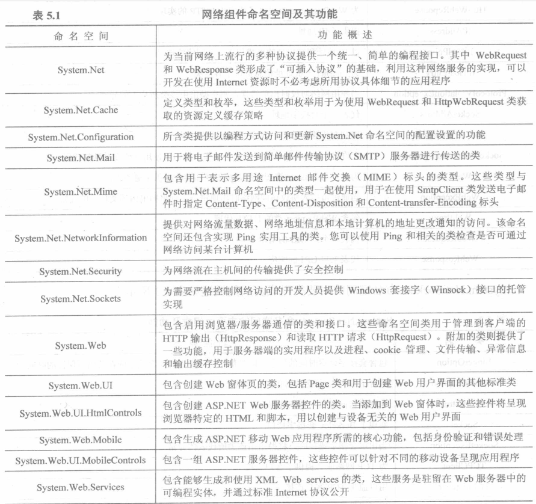

# Socket编程

[TOC]

# 一、什么是Socket(套接字）

**Socket**（套接字）是计算机网络编程中用于**进程间通信**的接口，允许不同主机上的程序通过网络发送和接收数据。

> 一句话：**TCP 是传输层协议；Socket 是操作系统给程序的 API 接口，用来使用 TCP/UDP 等网络协议**。
> TCP 是规则，Socket 是干活的工具。
>
> 通信模式：**客户端 ↔ 服务端**

Socket用专业术语说就是**套接字**

# 二、Socket相关概念

## 2.1 两大主流传输协议

| 对比     | TCP（流式套接字 SOCK_STREAM）        | UDP（数据报套接字 SOCK_DGRAM） |
| -------- | ------------------------------------ | ------------------------------ |
| 连接     | 面向连接，先建立连接再通信           | 无连接，直接发包，不建立连接   |
| 可靠度   | 可靠传输，确认、重传、丢包重发、有序 | 不可靠，无确认，可能丢包、乱序 |
| 数据形式 | 字节流，无边界                       | 独立数据包，自带边界           |
| 拥塞控制 | 有                                   | 无                             |
| 典型场景 | 文件传输、HTTP、数据库、上位机通信   | 直播、语音视频、DNS、广播      |

## 2.2 套接字地址和端口号

Socket=IP+Port

IP地址标识主机，Port标识应用程序。

# 三、.NET实现TCP和UDP编程

## 3.1 .NET中网络开发类的介绍

.NET框架为网络开发提供两个顶层命名：System.Net和System.Web。



其中System.Net，System.Net.Socket，System.Web是比较常用的网络组件。

System.Net命名空间主要类组成及功能介绍：


System.Net.Socket命名空间主要类组成及功能介绍：


System.Web命名空间主要类组成及功能介绍：


## 3.2 四个 Wrapper 的封装思路

### **共同设计原则**

1. **网络层只传 byte[]** — 不做任何编码/解码，ASCII/Hex/GBK/UTF-8 全部交给 UI 层的 `MessageFormatter` 处理，避免二次编码污染
2. 事件驱动 — 统一暴露三个事件：
   - `DataReceived(byte[] data, IPEndPoint? ep, bool isSelf)` — 收到数据/自收回显
   - `Log(string msg)` — 状态日志
   - `Disconnected(bool intentional)` — 仅 Client 侧，用于触发自动重连
3. **async/await + CancellationToken** — 所有接收循环都可被 `Stop()` 取消
4. **IDisposable** — Stop/Dispose 统一释放 Socket
5. **类名加 Wrapper 后缀** — 避免与 BCL 的 `TcpClient`/`UdpClient` 冲突

### TcpServerWrapper（面向连接 · 多客户端）

- **核心对象**：`TcpListener` + `List<TcpClient>`（lock 保护）
- 两个循环：
  - `AcceptLoopAsync` — 死循环 `AcceptTcpClientAsync()`，每个新连接加入列表，**为每个客户端起独立的接收循环**
  - 每客户端 `ReceiveLoopAsync` — 读 `NetworkStream`，断连时从列表移除
- **发送**：`BroadcastAsync` 快照列表后逐个 `stream.WriteAsync`
- **特点**：TCP 有连接，客户端集合是确定的；`DataReceived` 事件带具体客户端 EP

### TcpClientWrapper（面向连接 · 单连接）

- **核心对象**：`TcpClient` + `NetworkStream`
- **流程**：`ConnectAsync` → 拿 Stream → 起 `ReceiveLoopAsync`（循环 `ReadAsync`，返回 0 = 服务端关闭）
- **发送**：`SendAsync` 直接写 Stream（已连接，无需带地址）
- **断开检测**：Read 返回 0 或抛异常 → `finally` 里触发 `Disconnected(false)` → UI 层启动重连循环
- **特点**：单连接模型，重连逻辑放在 UI 层（Wrapper 保持纯粹）

### UdpServerWrapper（无连接 · SendTo/ReceiveFrom）

- **核心对象**：`Socket`（`Dgram` + `Udp`）
- 关键点：UDP 没有"已连接客户端"，所以自己维护：
  - `List<IPEndPoint> _knownClients` + `HashSet` 去重
  - 每次 `ReceiveFromAsync` 拿到 `RemoteEndPoint` 就登记
- 发送三档：
  - `SendToAsync(data, ep)` — 底层 `Socket.SendToAsync`
  - `SendToLastClientAsync` — 发给最近一个
  - `BroadcastToKnownClientsAsync` — 遍历已知客户端
- **接收**：`ReceiveFromAsync` 每包都能拿到**发送方地址**（UDP 的天然优势）
- **回显**：收到包后直接用包来源 EP 做目标 SendTo

### UdpClientWrapper（无连接 · SendTo/ReceiveFrom）

- **核心对象**：同样是 `Socket`（Dgram + Udp）
- **Bind 本地端口**（可指定，0 = 系统分配）+ 记住默认远端 EP
- 发送两档：
  - `SendAsync(data)` — 发给 Connect 时保存的默认远端
  - `SendToAsync(data, target)` — 发任意目标（广播 255.255.255.255 或自定义 IP）
- **接收**：`ReceiveFromAsync` 循环，同样能拿到每个包的来源
- **Socket 选项**：`Broadcast = true`（允许发广播包）+ `ReuseAddress`

| 维度     | TCP Server                 | TCP Client                | UDP Server                | UDP Client                |
| -------- | -------------------------- | ------------------------- | ------------------------- | ------------------------- |
| 底层对象 | TcpListener + 多 TcpClient | TcpClient + NetworkStream | Socket(Dgram)             | Socket(Dgram)             |
| 连接模型 | 多连接，Accept 循环        | 单连接                    | 无连接                    | 无连接                    |
| 收发 API | Accept/Stream.Read/Write   | Connect/Stream.Read/Write | **ReceiveFrom/SendTo**    | **ReceiveFrom/SendTo**    |
| 发送目标 | 遍历已连接客户端           | 固定（已连接）            | 已知客户端列表/任意 EP    | 默认远端/任意 EP          |
| 对端地址 | 连接时确定                 | 连接时确定                | **每包 ReceiveFrom 获得** | **每包 ReceiveFrom 获得** |
| 重连     | —                          | UI 层定时重连             | 无需（无连接）            | 无需（无连接）            |


## 3.3 TCP编程流程详解


**TCPServerWrapper封装：**

```C#
using System.Net;
using System.Net.Sockets;

namespace CommunicateDemo.Services
{
    /// <summary>
    /// TCP 服务端封装
    /// 网络层只传 byte[]，不做任何编码/解码
    /// </summary>
    public class TcpServerWrapper : IDisposable
    {
        private TcpListener? _listener;
        private CancellationTokenSource? _cts;
        private readonly List<TcpClient> _clients = [];
        private readonly object _lock = new object();
        private IPEndPoint? _listenEp;
        public bool IsRuning { get; private set; }
        /// <summary>收到原始字节事件：(原始数据, 远端EP, 是否来自服务端自己发送的广播)</summary>
        public event Action<byte[], IPEndPoint?, bool>? DataReceived;
        public event Action<string>? Log;

        public async Task StartAsync(string ip, int port)
        {
            if (IsRuning) return;
            _cts = new CancellationTokenSource();
            IPAddress address = string.IsNullOrEmpty(ip) ? IPAddress.Any : IPAddress.Parse(ip);
            _listenEp = new IPEndPoint(address, port);
            _listener = new TcpListener(_listenEp);
            _listener.Start();
            IsRuning = true;
            Log?.Invoke($"TCP服务端已启动，监听 {_listenEp}");
            // 持续循环异步等待新客户端接入的后台循环
            _ = AcceptLoopAsync(_cts.Token);
            await Task.CompletedTask;
        }

        public void Stop()
        {
            if (!IsRuning) return;
            IsRuning = false;
            _cts?.Cancel();
            lock (_lock)
            {
                foreach (TcpClient client in _clients)
                {
                    try
                    {
                        client.Close();
                    }
                    catch (Exception) { }
                }
                _clients.Clear();
            }
            _listener?.Stop();
            Log?.Invoke($"Tcp Server 已停止");
        }

        private async Task AcceptLoopAsync(CancellationToken token)
        {
            try
            {
                while (!token.IsCancellationRequested)
                {
                    var client = await _listener!.AcceptTcpClientAsync(token);
                    lock (_lock)
                    {
                        _clients.Add(client);
                    }
                    var ep = client.Client.RemoteEndPoint!;
                    Log?.Invoke($"新客户端连接: {ep}");
                    _ = HandleClientAsync(client, ep, token);
                }
            }
            catch (OperationCanceledException) { }
            catch (Exception ex)
            {
                Log?.Invoke($"Accept 异常: {ex.Message}");
            }

        }

        private async Task HandleClientAsync(TcpClient client, EndPoint ep, CancellationToken token)
        {
            try
            {
                using (client)
                {
                    var stream = client.GetStream();
                    var buffer = new byte[65535];
                    while (!token.IsCancellationRequested && client.Client.Connected)
                    {
                        int read = await stream.ReadAsync(buffer, token);
                        if (read == 0) break; // 客户端关闭连接
                        // 拷贝一份避免 buffer 被复用
                        var copy = new byte[read];
                        Buffer.BlockCopy(buffer, 0, copy, 0, read);
                        DataReceived?.Invoke(copy, (IPEndPoint)ep, false);
                        // 回显：原样返回（由调用方决定是否加前缀）
                        await stream.WriteAsync(copy, token);
                    }
                }
            }
            catch (OperationCanceledException) { }
            catch (Exception ex)
            {
                Log?.Invoke($"处理客户端 {ep} 时发生异常: {ex.Message}");
            }
            finally
            {
                lock (_lock) { _ = _clients.Remove(client); }
                Log?.Invoke($"客户端断开: {ep}");
            }
        }

        /// <summary>向所有已连接客户端广播原始字节</summary>
        public async Task BroadcastAsync(byte[] data)
        {
            List<System.Net.Sockets.TcpClient> snapshot;
            lock (_lock) { snapshot = new List<System.Net.Sockets.TcpClient>(_clients); }
            foreach (var client in snapshot)
            {
                try
                {
                    NetworkStream stream = client.GetStream();
                    await stream.WriteAsync(data);
                }
                catch (Exception ex)
                {
                    Log?.Invoke($"广播失败: {ex.Message}");
                }
            }
            // 触发自收事件，带上本机监听地址
            DataReceived?.Invoke(data, _listenEp, true);
        }

        /// <summary>向指定客户端定向发送</summary>
        public async Task SendToAsync(byte[] data, System.Net.Sockets.TcpClient client)
        {
            try
            {
                var stream = client.GetStream();
                await stream.WriteAsync(data);
            }
            catch (Exception ex)
            {
                Log?.Invoke($"定向发送失败: {ex.Message}");
            }
        }

        public void Dispose() => Stop();
    }
}
```

**TCPClientWrapper封装：**

```C#
using System;
using System.Net;
using System.Net.Sockets;
using System.Threading;
using System.Threading.Tasks;

namespace CommunicateDemo.Services;

/// <summary>
/// TCP 客户端封装 — 网络层只传 byte[]
/// </summary>
public class TcpClientWrapper : IDisposable
{
    private System.Net.Sockets.TcpClient? _client;
    private NetworkStream? _stream;
    private CancellationTokenSource? _cts;

    public bool IsConnected { get; private set; }

    /// <summary>原始字节数据事件</summary>
    public event Action<byte[], IPEndPoint?, bool>? DataReceived;
    public event Action<string>? Log;
    /// <summary>连接意外断开事件（参数=是否主动断开）</summary>
    public event Action<bool>? Disconnected;

    public async Task ConnectAsync(string ip, int port)
    {
        if (IsConnected) return;

        _client = new System.Net.Sockets.TcpClient();
        await _client.ConnectAsync(ip, port);
        _stream = _client.GetStream();
        _cts = new CancellationTokenSource();
        IsConnected = true;

        var ep = _client.Client.RemoteEndPoint as IPEndPoint;
        Log?.Invoke($"已连接到 TCP Server {ep}");

        // `_` 是弃元（discard），意思：我调用这个异步方法，但不接收它返回的 `Task`，不等待它，也不保存变量。
        _ = ReceiveLoopAsync(_cts.Token);
    }

    /// <summary>发送原始字节</summary>
    public async Task SendAsync(byte[] data)
    {
        if (!IsConnected || _stream == null || _client == null)
            throw new InvalidOperationException("未连接");
        await _stream.WriteAsync(data);
        var remoteEp = (IPEndPoint)_client.Client.RemoteEndPoint!;
        DataReceived?.Invoke(data, remoteEp, true); // 自收：带远端地址
    }

    public void Disconnect()
    {
        if (!IsConnected) return;
        IsConnected = false;
        _cts?.Cancel();
        try { _stream?.Close(); } catch { }
        try { _client?.Close(); } catch { }
        Log?.Invoke("TCP 客户端已断开");
        Disconnected?.Invoke(true); // 主动
    }

    private async Task ReceiveLoopAsync(CancellationToken ct)
    {
        try
        {
            var buffer = new byte[65536];
            while (!ct.IsCancellationRequested && _stream != null)
            {
                int read = await _stream.ReadAsync(buffer, ct);
                if (read == 0) break;
                var copy = new byte[read];
                Buffer.BlockCopy(buffer, 0, copy, 0, read);
                DataReceived?.Invoke(copy, null, false);
            }
        }
        catch (OperationCanceledException) { }
        catch (Exception ex)
        {
            Log?.Invoke($"接收异常: {ex.Message}");
        }
        finally
        {
            bool wasActive = IsConnected;
            IsConnected = false;
            if (wasActive && !ct.IsCancellationRequested)
            {
                Log?.Invoke("连接已断开");
                Disconnected?.Invoke(false); // 意外断开
            }
        }
    }

    public void Dispose() => Disconnect();
}

```


## 3.4 UDP编程流程详解

与TCP通信不同，UDP通信是不分服务端和客户端的，通信双方是对等的。为了描述方便，我们把通信双方称为发送方和接收方。

、

**UdpServerWrapper封装：**

```C#
using System;
using System.Net;
using System.Net.Sockets;

namespace CommunicateDemo.Services;

/// <summary>
/// UDP 服务端 — 基于 Socket 的 SendTo/ReceiveFrom
/// 维护已知客户端列表，支持主动向已知客户端发送
/// </summary>
public class UdpServerWrapper : IDisposable
{
    private Socket? _socket;
    private CancellationTokenSource? _cts;
    private IPEndPoint? _listenEp;
    // 已知客户端（收到过数据的对端）—— 去重
    private readonly HashSet<string> _knownKeys = new();
    private readonly List<IPEndPoint> _knownClients = new();
    private readonly object _lock = new();
    public bool IsRunning { get; private set; }

    public event Action<byte[], IPEndPoint?, bool>? DataReceived;
    public event Action<string>? Log;
    /// <summary>最近一次收到数据的对端</summary>
    public IPEndPoint? LastClient { get; private set; }

    public async Task StartAsync(string ip, int port)
    {
        if (IsRunning) return;
        _cts = new CancellationTokenSource();
        IPAddress address = string.IsNullOrEmpty(ip) || ip == "0.0.0.0"
           ? IPAddress.Any
           : IPAddress.Parse(ip);
        _listenEp = new IPEndPoint(address, port);
        _socket = new Socket(AddressFamily.InterNetwork, SocketType.Dgram, ProtocolType.Udp);
        _socket.SetSocketOption(SocketOptionLevel.Socket, SocketOptionName.Broadcast, true);
        _socket.SetSocketOption(SocketOptionLevel.Socket, SocketOptionName.ReuseAddress, true);
        _socket.Bind(new IPEndPoint(address, port));
        IsRunning = true;
        Log?.Invoke($"UDP Server 已启动，监听 {address}:{port}");

        _ = ReceiveLoopAsync(_cts.Token);
        await Task.CompletedTask;
    }

    private async Task ReceiveLoopAsync(CancellationToken ct)
    {
        var buffer = new byte[65536];
        try
        {
            while (!ct.IsCancellationRequested && _socket != null)
            {
                // 使用 Socket.ReceiveFromAsync — 标准 UDP recvfrom
                var remoteEp = new IPEndPoint(IPAddress.Any, 0);
                var result = await _socket.ReceiveFromAsync(
                    new Memory<byte>(buffer), SocketFlags.None, remoteEp, ct);

                // 记录对端为已知客户端
                var sender = result.RemoteEndPoint as IPEndPoint ?? remoteEp;
                RegisterClient(sender);

                // 拷贝实际收到的数据
                int received = result.ReceivedBytes;
                var copy = new byte[received];
                Buffer.BlockCopy(buffer, 0, copy, 0, received);
                DataReceived?.Invoke(copy, sender, false);

                // 回显
                await SendToAsync(copy, sender);
            }
        }
        catch (OperationCanceledException) { }
        catch (ObjectDisposedException) { }
        catch (Exception ex)
        {
            Log?.Invoke($"UDP 接收异常: {ex.Message}");
        }
    }

    /// <summary>向指定远端发送原始字节（底层）</summary>
    private async Task SendToAsync(byte[] data, IPEndPoint ep)
    {
        if (_socket == null) throw new InvalidOperationException("UDP 未启动");
        await _socket.SendToAsync(new ReadOnlyMemory<byte>(data), SocketFlags.None, ep);
    }

    public void Dispose() => Stop();
    public void Stop()
    {
        if (!IsRunning) return;
        IsRunning = false;
        _cts?.Cancel();
        try { _socket?.Close(); _socket?.Dispose(); } catch { }
        _socket = null;
        lock (_lock) { _knownClients.Clear(); _knownKeys.Clear(); LastClient = null; }
        Log?.Invoke("UDP Server 已停止");
    }

    /// <summary>获取所有已知客户端端点的副本</summary>
    public List<IPEndPoint> GetKnownClients()
    {
        lock (_lock) { return new List<IPEndPoint>(_knownClients); }
    }

    /// <summary>向最近一次通信的客户端发送</summary>
    public async Task<bool> SendToLastClientAsync(byte[] data)
    {
        IPEndPoint? target;
        lock (_lock) { target = LastClient; }
        if (target == null) return false;

        await SendToAsync(data, target);
        DataReceived?.Invoke(data, _listenEp, true); // 自收
        return true;
    }
    /// <summary>向指定客户端发送</summary>
    public async Task<bool> SendToClientAsync(byte[] data, IPEndPoint target)
    {
        await SendToAsync(data, target);
        DataReceived?.Invoke(data, _listenEp, true); // 自收
        return true;
    }
    /// <summary>向所有已知客户端广播</summary>
    public async Task BroadcastToKnownClientsAsync(byte[] data)
    {
        List<IPEndPoint> targets;
        lock (_lock) { targets = new List<IPEndPoint>(_knownClients); }

        foreach (var ep in targets)
        {
            try { await SendToAsync(data, ep); }
            catch (Exception ex) { Log?.Invoke($"向 {ep} 发送失败: {ex.Message}"); }
        }
        DataReceived?.Invoke(data, _listenEp, true); // 自收
    }

    private void RegisterClient(IPEndPoint ep)
    {
        lock (_lock)
        {
            LastClient = ep;
            var key = ep.ToString();
            if (_knownKeys.Add(key))
                _knownClients.Add(ep);
        }
    }
}

```

**UdpClientWrapper封装：**

```C#
using System;
using System.Net;
using System.Net.Sockets;
using System.Threading;
using System.Threading.Tasks;

namespace CommunicateDemo.Services;

/// <summary>
/// UDP 客户端 — 基于 Socket 的 SendTo/ReceiveFrom
/// 支持定向发送、广播、自定义目标
/// </summary>
public class UdpClientWrapper : IDisposable
{
    private Socket? _socket;
    private CancellationTokenSource? _cts;
    private IPEndPoint? _remoteEp;
    private IPEndPoint? _localEp;

    public bool IsRunning { get; private set; }
    public int LocalPort => (_localEp)?.Port ?? 0;

    public event Action<byte[], IPEndPoint?, bool>? DataReceived;
    public event Action<string>? Log;
    /// <summary>接收循环意外终止事件</summary>
    public event Action<bool>? Disconnected;

    /// <summary>
    /// 初始化 UDP 客户端
    /// </summary>
    public async Task StartAsync(int localPort, string remoteIp, int remotePort)
    {
        if (IsRunning) return;

        _cts = new CancellationTokenSource();
        _socket = new Socket(AddressFamily.InterNetwork, SocketType.Dgram, ProtocolType.Udp);
        _socket.SetSocketOption(SocketOptionLevel.Socket, SocketOptionName.Broadcast, true);
        _socket.SetSocketOption(SocketOptionLevel.Socket, SocketOptionName.ReuseAddress, true);

        _localEp = new IPEndPoint(IPAddress.Any, localPort);
        _socket.Bind(_localEp);

        _remoteEp = new IPEndPoint(IPAddress.Parse(remoteIp), remotePort);
        IsRunning = true;

        Log?.Invoke($"UDP Client 已启动（本地端口:{LocalPort}），目标 {_remoteEp}");
        _ = ReceiveLoopAsync(_cts.Token);
        await Task.CompletedTask;
    }

    /// <summary>发送原始字节（默认发给 Connect 时指定的远端）— 使用 Socket.SendTo</summary>
    public async Task SendAsync(byte[] data)
    {
        if (!IsRunning || _socket == null || _remoteEp == null)
            throw new InvalidOperationException("UDP 客户端未启动");
        await _socket.SendToAsync(new ReadOnlyMemory<byte>(data), SocketFlags.None, _remoteEp);
        DataReceived?.Invoke(data, _remoteEp, true);
    }

    /// <summary>发送原始字节到指定目标 IP:Port（支持广播和任意目标）— 使用 Socket.SendTo</summary>
    public async Task SendToAsync(byte[] data, IPEndPoint target)
    {
        if (!IsRunning || _socket == null)
            throw new InvalidOperationException("UDP 客户端未启动");
        await _socket.SendToAsync(new ReadOnlyMemory<byte>(data), SocketFlags.None, target);
        DataReceived?.Invoke(data, target, true);
    }

    public void Stop()
    {
        if (!IsRunning) return;
        IsRunning = false;
        _cts?.Cancel();
        try { _socket?.Close(); _socket?.Dispose(); } catch { }
        _socket = null;
        Log?.Invoke("UDP Client 已停止");
        Disconnected?.Invoke(true);
    }

    private async Task ReceiveLoopAsync(CancellationToken ct)
    {
        var buffer = new byte[65536];
        try
        {
            while (!ct.IsCancellationRequested && _socket != null)
            {
                // 使用 Socket.ReceiveFromAsync — 标准 UDP recvfrom
                var remoteEp = new IPEndPoint(IPAddress.Any, 0);
                var result = await _socket.ReceiveFromAsync(
                    new Memory<byte>(buffer), SocketFlags.None, remoteEp, ct);

                var sender = result.RemoteEndPoint as IPEndPoint ?? remoteEp;
                int received = result.ReceivedBytes;
                var copy = new byte[received];
                Buffer.BlockCopy(buffer, 0, copy, 0, received);
                DataReceived?.Invoke(copy, sender, false);
            }
        }
        catch (OperationCanceledException) { }
        catch (ObjectDisposedException) { }
        catch (Exception ex)
        {
            Log?.Invoke($"UDP 接收异常: {ex.Message}");
        }
        finally
        {
            bool wasActive = IsRunning;
            IsRunning = false;
            if (wasActive && !ct.IsCancellationRequested)
            {
                Log?.Invoke("UDP 接收循环已终止");
                Disconnected?.Invoke(false);
            }
        }
    }

    public void Dispose() => Stop();
}

```

## 3.5 界面和对应的cs文件实现

MainWindow.xaml界面：

```xml
<Window
    x:Class="CommunicateDemo.MainWindow"
    xmlns="http://schemas.microsoft.com/winfx/2006/xaml/presentation"
    xmlns:x="http://schemas.microsoft.com/winfx/2006/xaml"
    xmlns:conv="clr-namespace:CommunicateDemo.Converters"
    xmlns:d="http://schemas.microsoft.com/expression/blend/2008"
    xmlns:local="clr-namespace:CommunicateDemo"
    xmlns:mc="http://schemas.openxmlformats.org/markup-compatibility/2006"
    Title="TCP/UDP 通信调试助手"
    Width="960"
    Height="720"
    mc:Ignorable="d">
    <Window.Resources>
        <conv:BoolToColorConverter x:Key="BoolToColorConverter" />
    </Window.Resources>
    <Grid Margin="10">
        <Grid.RowDefinitions>
            <RowDefinition Height="*" />
            <RowDefinition Height="Auto" />
        </Grid.RowDefinitions>
        <TabControl
            x:Name="MainTab"
            Grid.Row="0"
            SelectedIndex="0">
            <TabItem Header="🖥  Server（服务端）">
                <Grid Margin="8">
                    <Grid.RowDefinitions>
                        <RowDefinition Height="Auto" />
                        <RowDefinition Height="Auto" />
                        <RowDefinition Height="*" />
                        <RowDefinition Height="Auto" />
                    </Grid.RowDefinitions>
                    <!--  协议 + 地址配置  -->
                    <StackPanel
                        Grid.Row="0"
                        Margin="0,0,0,6"
                        Orientation="Horizontal">
                        <TextBlock
                            Margin="0,0,4,0"
                            VerticalAlignment="Center"
                            Text="协议:" />
                        <RadioButton
                            x:Name="ServerTcpRadio"
                            Margin="0,0,16,0"
                            Content="TCP"
                            IsChecked="True" />
                        <RadioButton
                            x:Name="ServerUdpRadio"
                            Margin="0,0,16,0"
                            Content="UDP" />

                        <TextBlock
                            Margin="0,0,4,0"
                            VerticalAlignment="Center"
                            Text="监听 IP:" />
                        <ComboBox
                            x:Name="ServerIpCombo"
                            Width="160"
                            Margin="0,0,12,0"
                            VerticalContentAlignment="Center"
                            IsEditable="True" />

                        <TextBlock
                            Margin="0,0,4,0"
                            VerticalAlignment="Center"
                            Text="端口:" />
                        <TextBox
                            x:Name="ServerPortBox"
                            Width="70"
                            Margin="0,0,16,0"
                            VerticalContentAlignment="Center"
                            Text="8080" />

                        <Button
                            x:Name="ServerStartBtn"
                            Width="80"
                            Margin="0,0,8,0"
                            Click="ServerStartBtn_Click"
                            Content="Start" />
                        <Button
                            x:Name="ServerStopBtn"
                            Width="80"
                            Click="ServerStopBtn_Click"
                            Content="Stop"
                            IsEnabled="False" />
                    </StackPanel>

                    <!--  接收格式 + 编码  -->
                    <StackPanel
                        Grid.Row="1"
                        Margin="0,0,0,6"
                        Orientation="Horizontal">
                        <TextBlock
                            Margin="0,0,4,0"
                            VerticalAlignment="Center"
                            Text="显示:" />
                        <ComboBox
                            x:Name="ServerRxFmtCombo"
                            Width="80"
                            SelectionChanged="ServerFmt_Changed">
                            <ComboBoxItem Content="Ascii" Tag="Ascii" />
                            <ComboBoxItem Content="Hex" Tag="Hex" />
                        </ComboBox>
                        <TextBlock
                            Margin="16,0,4,0"
                            VerticalAlignment="Center"
                            Text="编码:" />
                        <ComboBox
                            x:Name="ServerRxEncCombo"
                            Width="80"
                            SelectionChanged="ServerFmt_Changed">
                            <ComboBoxItem
                                Content="UTF-8"
                                IsSelected="True"
                                Tag="Utf8" />
                            <ComboBoxItem Content="GBK" Tag="Gbk" />
                            <ComboBoxItem Content="ASCII" Tag="Ascii" />
                        </ComboBox>
                        <TextBlock
                            Margin="16,0,4,0"
                            VerticalAlignment="Center"
                            Text="发送:" />
                        <ComboBox x:Name="ServerTxFmtCombo" Width="80">
                            <ComboBoxItem
                                Content="Ascii"
                                IsSelected="True"
                                Tag="Ascii" />
                            <ComboBoxItem Content="Hex" Tag="Hex" />
                        </ComboBox>
                        <TextBlock
                            Margin="4,0,4,0"
                            VerticalAlignment="Center"
                            Text="编码:" />
                        <ComboBox x:Name="ServerTxEncCombo" Width="80">
                            <ComboBoxItem
                                Content="UTF-8"
                                IsSelected="True"
                                Tag="Utf8" />
                            <ComboBoxItem Content="GBK" Tag="Gbk" />
                            <ComboBoxItem Content="ASCII" Tag="Ascii" />
                        </ComboBox>
                    </StackPanel>
                    <!--  消息列表 + 日志  -->
                    <Grid Grid.Row="2">
                        <Grid.RowDefinitions>
                            <RowDefinition Height="*" />
                            <RowDefinition Height="Auto" />
                        </Grid.RowDefinitions>
                        <ListBox
                            x:Name="ServerMsgList"
                            Grid.Row="0"
                            FontFamily="Consolas"
                            FontSize="12"
                            ScrollViewer.HorizontalScrollBarVisibility="Auto">
                            <ListBox.ItemTemplate>
                                <DataTemplate>
                                    <TextBlock Foreground="{Binding IsSelf, Converter={StaticResource BoolToColorConverter}}" Text="{Binding Display}" />
                                </DataTemplate>
                            </ListBox.ItemTemplate>
                        </ListBox>

                        <TextBox
                            x:Name="ServerLogBox"
                            Grid.Row="1"
                            Height="70"
                            Margin="0,6,0,0"
                            Background="#FFF5F5F5"
                            FontFamily="Consolas"
                            FontSize="12"
                            IsReadOnly="True"
                            TextWrapping="Wrap"
                            VerticalScrollBarVisibility="Auto" />
                    </Grid>
                    <!--  发送区 + 导出  -->
                    <Grid Grid.Row="3" Margin="0,6,0,0">
                        <Grid.ColumnDefinitions>
                            <ColumnDefinition Width="Auto" />
                            <ColumnDefinition Width="130" />
                            <ColumnDefinition Width="Auto" />
                            <ColumnDefinition Width="60" />
                            <ColumnDefinition Width="Auto" />
                            <ColumnDefinition Width="*" />
                            <ColumnDefinition Width="Auto" />
                            <ColumnDefinition Width="Auto" />
                            <ColumnDefinition Width="Auto" />
                            <ColumnDefinition Width="Auto" />
                        </Grid.ColumnDefinitions>

                        <!--  UDP 定向目标（仅 UDP 模式可见）  -->
                        <TextBlock
                            x:Name="ServerTargetLabel"
                            Grid.Column="0"
                            Margin="0,0,4,0"
                            VerticalAlignment="Center"
                            Text="目标 IP:"
                            Visibility="Collapsed" />
                        <ComboBox
                            x:Name="ServerTargetIpCombo"
                            Grid.Column="1"
                            VerticalContentAlignment="Center"
                            IsEditable="True"
                            SelectionChanged="ServerTargetIpCombo_SelectionChanged"
                            Visibility="Collapsed" />
                        <TextBlock
                            x:Name="ServerTargetPortLabel"
                            Grid.Column="2"
                            Margin="0,0,4,0"
                            VerticalAlignment="Center"
                            Text="端口:"
                            Visibility="Collapsed" />
                        <TextBox
                            x:Name="ServerTargetPortBox"
                            Grid.Column="3"
                            Width="50"
                            VerticalContentAlignment="Center"
                            Text="8080"
                            Visibility="Collapsed" />
                        <Button
                            x:Name="ServerUdpBroadcastBtn"
                            Grid.Column="4"
                            Width="56"
                            Margin="6,0,0,0"
                            Click="ServerUdpBroadcastBtn_Click"
                            Content="广播"
                            Visibility="Collapsed" />

                        <TextBox
                            x:Name="ServerSendBox"
                            Grid.Column="5"
                            Margin="4,0,0,0"
                            VerticalContentAlignment="Center"
                            KeyDown="ServerSendBox_KeyDown"
                            TextWrapping="NoWrap" />
                        <Button
                            x:Name="ServerSendBtn"
                            Grid.Column="6"
                            Width="80"
                            Margin="8,0,4,0"
                            Click="ServerSendBtn_Click"
                            Content="Send" />
                        <Button
                            x:Name="ServerClearBtn"
                            Grid.Column="7"
                            Width="70"
                            Margin="0,0,4,0"
                            Click="ServerClearBtn_Click"
                            Content="Clear" />
                        <Button
                            x:Name="ServerExportMsgBtn"
                            Grid.Column="8"
                            Width="80"
                            Margin="0,0,4,0"
                            Click="ServerExportMsg_Click"
                            Content="导出消息" />
                        <Button
                            x:Name="ServerExportLogBtn"
                            Grid.Column="9"
                            Width="80"
                            Click="ServerExportLog_Click"
                            Content="导出日志" />
                    </Grid>
                </Grid>
            </TabItem>
            <TabItem Header="💻 Client（客户端）">
                <Grid Margin="8">
                    <Grid.RowDefinitions>
                        <RowDefinition Height="Auto" />
                        <RowDefinition Height="Auto" />
                        <RowDefinition Height="*" />
                        <RowDefinition Height="Auto" />
                    </Grid.RowDefinitions>

                    <!--  协议 + 地址配置  -->
                    <StackPanel
                        Grid.Row="0"
                        Margin="0,0,0,6"
                        Orientation="Horizontal">
                        <TextBlock
                            Margin="0,0,4,0"
                            VerticalAlignment="Center"
                            Text="协议:" />
                        <RadioButton
                            x:Name="ClientTcpRadio"
                            Margin="0,0,16,0"
                            Checked="ClientTcpRadio_Checked"
                            Content="TCP"
                            IsChecked="True" />
                        <RadioButton
                            x:Name="ClientUdpRadio"
                            Margin="0,0,16,0"
                            Checked="ClientUdpRadio_Checked"
                            Content="UDP" />

                        <TextBlock
                            x:Name="ClientLocalPortLabel"
                            Margin="0,0,4,0"
                            VerticalAlignment="Center"
                            Text="本地端口:"
                            Visibility="Collapsed" />
                        <TextBox
                            x:Name="ClientLocalPortBox"
                            Width="60"
                            Margin="0,0,12,0"
                            VerticalContentAlignment="Center"
                            Text="0"
                            Visibility="Collapsed" />

                        <TextBlock
                            Margin="0,0,4,0"
                            VerticalAlignment="Center"
                            Text="远端 IP:" />
                        <ComboBox
                            x:Name="ClientIpCombo"
                            Width="160"
                            Margin="0,0,12,0"
                            VerticalContentAlignment="Center"
                            IsEditable="True" />

                        <TextBlock
                            Margin="0,0,4,0"
                            VerticalAlignment="Center"
                            Text="端口:" />
                        <TextBox
                            x:Name="ClientPortBox"
                            Width="70"
                            Margin="0,0,16,0"
                            VerticalContentAlignment="Center"
                            Text="8080" />

                        <Button
                            x:Name="ClientConnectBtn"
                            Width="80"
                            Margin="0,0,8,0"
                            Click="ClientConnectBtn_Click"
                            Content="Connect" />
                        <Button
                            x:Name="ClientDisconnectBtn"
                            Width="100"
                            Click="ClientDisconnectBtn_Click"
                            Content="Disconnect"
                            IsEnabled="False" />
                        <CheckBox
                            x:Name="ClientAutoReconnectCheck"
                            Margin="16,0,0,0"
                            VerticalAlignment="Center"
                            Content="自动重连"
                            IsChecked="True" />
                    </StackPanel>

                    <!--  接收格式 + 编码  -->
                    <StackPanel
                        Grid.Row="1"
                        Margin="0,0,0,6"
                        Orientation="Horizontal">
                        <TextBlock
                            Margin="0,0,4,0"
                            VerticalAlignment="Center"
                            Text="显示:" />
                        <ComboBox
                            x:Name="ClientRxFmtCombo"
                            Width="80"
                            SelectionChanged="ClientFmt_Changed">
                            <ComboBoxItem Content="Ascii" Tag="Ascii" />
                            <ComboBoxItem Content="Hex" Tag="Hex" />
                        </ComboBox>
                        <TextBlock
                            Margin="16,0,4,0"
                            VerticalAlignment="Center"
                            Text="编码:" />
                        <ComboBox
                            x:Name="ClientRxEncCombo"
                            Width="80"
                            SelectionChanged="ClientFmt_Changed">
                            <ComboBoxItem
                                Content="UTF-8"
                                IsSelected="True"
                                Tag="Utf8" />
                            <ComboBoxItem Content="GBK" Tag="Gbk" />
                            <ComboBoxItem Content="ASCII" Tag="Ascii" />
                        </ComboBox>
                        <TextBlock
                            Margin="16,0,4,0"
                            VerticalAlignment="Center"
                            Text="发送:" />
                        <ComboBox x:Name="ClientTxFmtCombo" Width="80">
                            <ComboBoxItem
                                Content="Ascii"
                                IsSelected="True"
                                Tag="Ascii" />
                            <ComboBoxItem Content="Hex" Tag="Hex" />
                        </ComboBox>
                        <TextBlock
                            Margin="4,0,4,0"
                            VerticalAlignment="Center"
                            Text="编码:" />
                        <ComboBox x:Name="ClientTxEncCombo" Width="80">
                            <ComboBoxItem
                                Content="UTF-8"
                                IsSelected="True"
                                Tag="Utf8" />
                            <ComboBoxItem Content="GBK" Tag="Gbk" />
                            <ComboBoxItem Content="ASCII" Tag="Ascii" />
                        </ComboBox>
                    </StackPanel>

                    <!--  消息列表 + 日志  -->
                    <Grid Grid.Row="2">
                        <Grid.RowDefinitions>
                            <RowDefinition Height="*" />
                            <RowDefinition Height="Auto" />
                        </Grid.RowDefinitions>
                        <ListBox
                            x:Name="ClientMsgList"
                            Grid.Row="0"
                            FontFamily="Consolas"
                            FontSize="12"
                            ScrollViewer.HorizontalScrollBarVisibility="Auto">
                            <ListBox.ItemTemplate>
                                <DataTemplate>
                                    <TextBlock Foreground="{Binding IsSelf, Converter={StaticResource BoolToColorConverter}}" Text="{Binding Display}" />
                                </DataTemplate>
                            </ListBox.ItemTemplate>
                        </ListBox>

                        <TextBox
                            x:Name="ClientLogBox"
                            Grid.Row="1"
                            Height="70"
                            Margin="0,6,0,0"
                            Background="#FFF5F5F5"
                            FontFamily="Consolas"
                            FontSize="12"
                            IsReadOnly="True"
                            TextWrapping="Wrap"
                            VerticalScrollBarVisibility="Auto" />
                    </Grid>

                    <!--  发送区 + 导出  -->
                    <Grid Grid.Row="3" Margin="0,6,0,0">
                        <Grid.ColumnDefinitions>
                            <ColumnDefinition Width="*" />
                            <ColumnDefinition Width="Auto" />
                            <ColumnDefinition Width="Auto" />
                            <ColumnDefinition Width="Auto" />
                        </Grid.ColumnDefinitions>
                        <TextBox
                            x:Name="ClientSendBox"
                            Grid.Column="0"
                            VerticalContentAlignment="Center"
                            KeyDown="ClientSendBox_KeyDown"
                            TextWrapping="NoWrap" />
                        <Button
                            x:Name="ClientSendBtn"
                            Grid.Column="1"
                            Width="80"
                            Margin="8,0,4,0"
                            Click="ClientSendBtn_Click"
                            Content="Send" />
                        <Button
                            x:Name="ClientClearBtn"
                            Grid.Column="2"
                            Width="70"
                            Margin="0,0,4,0"
                            Click="ClientClearBtn_Click"
                            Content="Clear" />
                        <StackPanel Grid.Column="3" Orientation="Horizontal">
                            <Button
                                Width="80"
                                Margin="0,0,4,0"
                                Click="ClientExportMsg_Click"
                                Content="导出消息" />
                            <Button
                                Width="80"
                                Click="ClientExportLog_Click"
                                Content="导出日志" />
                        </StackPanel>
                    </Grid>
                </Grid>
            </TabItem>
        </TabControl>
        <StatusBar Grid.Row="1" Margin="0,6,0,0">
            <StatusBarItem>
                <TextBlock x:Name="StatusText" Text="就绪 | 自动日志已启用: Logs\\log-YYYYMMdd.txt" />
            </StatusBarItem>
        </StatusBar>
    </Grid>
</Window>
```

MainWindow.xaml.cs实现：

```C#
using CommunicateDemo.Models;
using CommunicateDemo.Services;
using Microsoft.Win32;
using System.Collections.ObjectModel;
using System.IO;
using System.Net;
using System.Windows;
using System.Windows.Controls;
using System.Windows.Input;

namespace CommunicateDemo;

/// <summary>
/// Interaction logic for MainWindow.xaml
/// </summary>
public partial class MainWindow : Window
{
    // ========== Server 侧 ==========
    private TcpServerWrapper? _tcpServer;
    private UdpServerWrapper? _udpServer;
    private ObservableCollection<ChatMessage> _serverMessages = new();

    // ========== Client 侧 ==========
    private TcpClientWrapper? _tcpClient;
    private UdpClientWrapper? _udpClient;
    private ObservableCollection<ChatMessage> _clientMessages = new();

    // 重连相关
    private CancellationTokenSource? _reconnectCts;
    private (bool isTcp, string ip, int port, int localPort)? _connectParams;
    public MainWindow()
    {
        InitializeComponent();
        Loaded += (s, e) =>
        {
            RefreshIpCombos();
            RefreshServerKnownClients(); // 先初始化 ComboBox 为空
        };
        ServerMsgList.ItemsSource = _serverMessages;
        ClientMsgList.ItemsSource = _clientMessages;

        // Server 协议切换时刷新目标 ComboBox 可见性 + 目标列表
        ServerTcpRadio.Checked += (s, e) => ToggleServerTargetVisible();
        ServerUdpRadio.Checked += (s, e) => ToggleServerTargetVisible();
    }
    /// <summary>刷新 UDP 已知客户端到 IP ComboBox（仅列出所有不同的 IP，选中时自动带端口）</summary>
    private void RefreshServerKnownClients()
    {
        InvokeUi(() =>
        {
            var known = _udpServer?.GetKnownClients() ?? new List<IPEndPoint>();
            var currentIp = ServerTargetIpCombo.Text;
            var items = known.Select(ep => ep.ToString()).Prepend("255.255.255.255").ToList();

            ServerTargetIpCombo.ItemsSource = items;
            // 保持当前输入/选中的 IP（不要被覆盖）
            if (!string.IsNullOrEmpty(currentIp) && items.Contains(currentIp))
                ServerTargetIpCombo.SelectedItem = currentIp;
            else if (items.Count > 0)
                ServerTargetIpCombo.SelectedItem = items[0];
        });
    }

    private void ToggleServerTargetVisible()
    {
        bool isUdp = ServerUdpRadio.IsChecked == true;
        InvokeUi(() =>
        {
            var v = isUdp ? Visibility.Visible : Visibility.Collapsed;
            ServerTargetLabel.Visibility = v;
            ServerTargetIpCombo.Visibility = v;
            ServerTargetPortLabel.Visibility = v;
            ServerTargetPortBox.Visibility = v;
            ServerUdpBroadcastBtn.Visibility = v;
            if (isUdp) RefreshServerKnownClients();
        });
    }

    private void RefreshIpCombos()
    {
        var ips = NetworkHelper.GetLocalIPv4Addresses();
        ServerIpCombo.ItemsSource = ips;
        ServerIpCombo.SelectedItem = "0.0.0.0";
        ClientIpCombo.ItemsSource = ips;
        ClientIpCombo.SelectedItem = "127.0.0.1";
    }

    // ============================================================
    // 帮助方法
    // ============================================================
    private void InvokeUi(Action action) => Dispatcher.Invoke(action);

    private static T GetComboEnum<T>(ComboBox cb) where T : Enum
    {
        if (cb.SelectedItem is ComboBoxItem ci && ci.Tag is string tag)
            return (T)Enum.Parse(typeof(T), tag);
        return default!;
    }
    private MessageFormat GetRxFmt(ComboBox cb) => GetComboEnum<MessageFormat>(cb);
    private MessageFormat GetTxFmt(ComboBox cb) => GetComboEnum<MessageFormat>(cb);
    private TextEncoding GetRxEnc(ComboBox cb) => GetComboEnum<TextEncoding>(cb);
    private TextEncoding GetTxEnc(ComboBox cb) => GetComboEnum<TextEncoding>(cb);


    // ============================================================
    // Server 页 — Start / Stop
    // ============================================================
    private async void ServerStartBtn_Click(object sender, RoutedEventArgs e)
    {
        try
        {
            var ip = (ServerIpCombo.Text ?? "0.0.0.0").Trim();
            var port = int.Parse(ServerPortBox.Text.Trim());

            if (ServerTcpRadio.IsChecked == true)
            {
                _tcpServer = new TcpServerWrapper();
                _tcpServer.DataReceived += (bytes, ep, self) =>
                    AppendMessage(_serverMessages, bytes, ep?.ToString() ?? "unknown", self);
                _tcpServer.Log += msg => AppendLog(ServerLogBox, msg);
                await _tcpServer.StartAsync(ip, port);
            }
            else
            {
                _udpServer = new UdpServerWrapper();
                _udpServer.DataReceived += (bytes, ep, self) =>
                    AppendMessage(_serverMessages, bytes, ep?.ToString() ?? "unknown", self);
                _udpServer.Log += msg => AppendLog(ServerLogBox, msg);
                await _udpServer.StartAsync(ip, port);
            }
            ServerStartBtn.IsEnabled = false;
            ServerStopBtn.IsEnabled = true;
        }
        catch (Exception ex) { AppendLog(ServerLogBox, $"启动失败: {ex.Message}"); }
    }

    private void AppendLog(TextBox logBox, string msg)
    {
        InvokeUi(() =>
        {
            logBox.AppendText($"[{DateTime.Now:HH:mm:ss.fff}] {msg}\n");
            logBox.ScrollToEnd();
        });
        FileLogger.Write("LOG", msg);
    }

    private void AppendMessage(ObservableCollection<ChatMessage> list, byte[] raw, string sender, bool isSelf)
    {
        bool isServer = list == _serverMessages;
        var direction = isSelf ? "TX ▶" : "RX ◀";
        var ts = DateTime.Now;
        InvokeUi(() =>
        {
            var content = RenderContent(raw, isServer);
            var msg = new ChatMessage
            {
                RawData = raw,
                Sender = sender,
                IsSelf = isSelf,
                Timestamp = ts,
                Display = BuildDisplay(direction, ts, sender, content)
            };
            list.Add(msg);
            var lb = isServer ? ServerMsgList : ClientMsgList;
            if (lb.Items.Count > 0) lb.ScrollIntoView(lb.Items[lb.Items.Count - 1]);
        });

        // 日志框同步输出
        var rawHex = BitConverter.ToString(raw).Replace('-', ' ');
        var logLine = $"{direction} [{ts:HH:mm:ss.fff}] {sender,-20} {rawHex}";
        InvokeUi(() =>
        {
            var logBox = isServer ? ServerLogBox : ClientLogBox;
            logBox.AppendText(logLine + "\n");
            logBox.ScrollToEnd();
        });
        FileLogger.Write(isSelf ? "TX" : "RX", $"[{sender}] {rawHex}");
    }

    /// <summary>拼完整 Display = 头部 + 内容</summary>
    private string BuildDisplay(string direction, DateTime ts, string sender, object content)
    {
        return $"{direction} [{ts:HH:mm:ss.fff}] {sender,-22} {content}";
    }

    /// <summary>仅渲染消息内容部分（不含头部）</summary>
    private string RenderContent(byte[] raw, bool isServer)
    {
        MessageFormat fmt; TextEncoding enc;
        if (isServer)
        {
            fmt = GetRxFmt(ServerRxFmtCombo);
            enc = GetRxEnc(ServerRxEncCombo);
        }
        else
        {
            fmt = GetRxFmt(ClientRxFmtCombo);
            enc = GetRxEnc(ClientRxEncCombo);
        }
        return MessageFormatter.BytesToString(raw, fmt, enc);
    }

    private void ServerStopBtn_Click(object sender, RoutedEventArgs e)
    {
        _tcpServer?.Stop(); _tcpServer = null;
        _udpServer?.Stop(); _udpServer = null;
        ServerStartBtn.IsEnabled = true; ServerStopBtn.IsEnabled = false;
    }

    // ============================================================
    // 接收格式变化 → 重新渲染所有消息内容部分
    // ============================================================
    private void ServerFmt_Changed(object sender, System.Windows.Controls.SelectionChangedEventArgs e)
    {
        InvokeUi(() =>
        {
            foreach (var m in _serverMessages)
            {
                var dir = m.IsSelf ? "TX ▶" : "RX ◀";
                m.Display = BuildDisplay(dir, m.Timestamp, m.Sender, RenderContent(m.RawData, true));
            }
        });
    }

    // ============================================================
    // Server 页 — 发送 / 清空 / 导出
    // ============================================================
    private void ServerSendBox_KeyDown(object sender, System.Windows.Input.KeyEventArgs e)
    {
        if (e.Key == Key.Enter) { ServerSendBtn_Click(sender, e); e.Handled = true; }
    }

    private async void ServerSendBtn_Click(object sender, RoutedEventArgs e)
    {
        var text = ServerSendBox.Text;
        if (string.IsNullOrWhiteSpace(text)) return;
        try
        {
            var fmt = GetTxFmt(ServerTxFmtCombo);
            var enc = GetTxEnc(ServerTxEncCombo);
            var data = MessageFormatter.StringToBytes(text, fmt, enc);

            if (_tcpServer != null)
            {
                await _tcpServer.BroadcastAsync(data);
            }
            else if (_udpServer != null)
            {
                // UDP 无连接，发给最近一次通信的客户端；若有多个已知客户端则广播
                var known = _udpServer.GetKnownClients();
                if (known.Count == 0)
                {
                    AppendLog(ServerLogBox, "⚠️ UDP Server 暂无已知客户端，请先等客户端发一条消息");
                    return;
                }
                if (known.Count == 1)
                {
                    await _udpServer.SendToLastClientAsync(data);
                    AppendLog(ServerLogBox, $"已向 {_udpServer.LastClient} 发送");
                }
                else
                {
                    await _udpServer.BroadcastToKnownClientsAsync(data);
                    AppendLog(ServerLogBox, $"已向 {known.Count} 个已知客户端广播");
                }
            }
            else { AppendLog(ServerLogBox, "请先 Start Server"); return; }

            ServerSendBox.Clear();
        }
        catch (Exception ex) { AppendLog(ServerLogBox, $"发送失败: {ex.Message}"); }
    }

    private void ServerClearBtn_Click(object sender, RoutedEventArgs e) => _serverMessages.Clear();

    private void ServerExportMsg_Click(object sender, RoutedEventArgs e) => ExportList(_serverMessages, "ServerMessages");

    // ============================================================
    // 导出辅助
    // ============================================================
    private void ExportList(ObservableCollection<ChatMessage> list, string defaultName)
    {
        if (list.Count == 0) { MessageBox.Show("没有可导出的消息", "提示"); return; }
        var sfd = new SaveFileDialog
        {
            Filter = "文本文件 (*.txt)|*.txt|所有文件 (*.*)|*.*",
            FileName = $"{defaultName}-{DateTime.Now:yyyyMMdd-HHmmss}.txt"
        };
        if (sfd.ShowDialog() == true)
        {
            var lines = list.Select(m =>
                $"[{m.Timestamp:HH:mm:ss.fff}] {(m.IsSelf ? "TX" : "RX")} [{m.Sender}] 0x{BitConverter.ToString(m.RawData).Replace("-", "")} | {m.Display}");
            File.WriteAllLines(sfd.FileName, lines);
            MessageBox.Show($"已导出 {list.Count} 条消息到:\n{sfd.FileName}", "导出成功");
        }
    }

    private void ServerExportLog_Click(object sender, RoutedEventArgs e) => ExportTextBox(ServerLogBox, "ServerLog");

    private void ExportTextBox(TextBox tb, string defaultName)
    {
        if (string.IsNullOrWhiteSpace(tb.Text)) { MessageBox.Show("没有可导出的日志", "提示"); return; }
        var sfd = new SaveFileDialog
        {
            Filter = "文本文件 (*.txt)|*.txt|所有文件 (*.*)|*.*",
            FileName = $"{defaultName}-{DateTime.Now:yyyyMMdd-HHmmss}.txt"
        };
        if (sfd.ShowDialog() == true)
        {
            File.WriteAllText(sfd.FileName, tb.Text);
            MessageBox.Show($"已导出日志到:\n{sfd.FileName}", "导出成功");
        }
    }

    private void ClientTcpRadio_Checked(object sender, RoutedEventArgs e)
    {
        if (ClientLocalPortBox != null) ClientLocalPortBox.Visibility = Visibility.Collapsed;
        if (ClientLocalPortLabel != null) ClientLocalPortLabel.Visibility = Visibility.Collapsed;
    }

    private void ClientUdpRadio_Checked(object sender, RoutedEventArgs e)
    {
        if (ClientLocalPortBox != null) ClientLocalPortBox.Visibility = Visibility.Visible;
        if (ClientLocalPortLabel != null) ClientLocalPortLabel.Visibility = Visibility.Visible;
    }
    // ============================================================
    // Client 页 — Connect（含保存参数和注册重连）
    // ============================================================
    private void ClientDisconnectBtn_Click(object sender, RoutedEventArgs e)
    {
        StopReconnectLoop();
        if (_tcpClient != null)
        {
            _tcpClient.Disconnected -= onTcpDisconnected;
            _tcpClient.Disconnect();
            _tcpClient = null;
        }
        if (_udpClient != null)
        {
            _udpClient.Disconnected -= onUdpDisconnected;
            _udpClient.Stop();
            _udpClient = null;
        }
        _connectParams = null;
        ClientConnectBtn.IsEnabled = true; ClientDisconnectBtn.IsEnabled = false;
    }

    private void ClientFmt_Changed(object sender, System.Windows.Controls.SelectionChangedEventArgs e)
    {
        InvokeUi(() =>
        {
            foreach (var m in _clientMessages)
            {
                var dir = m.IsSelf ? "TX ▶" : "RX ◀";
                m.Display = BuildDisplay(dir, m.Timestamp, m.Sender, RenderContent(m.RawData, false));
            }
        });
    }

    private void ClientSendBox_KeyDown(object sender, System.Windows.Input.KeyEventArgs e)
    {
        if (e.Key == Key.Enter) { ClientSendBtn_Click(sender, e); e.Handled = true; }
    }

    private async void ClientSendBtn_Click(object sender, RoutedEventArgs e)
    {
        var text = ClientSendBox.Text;
        if (string.IsNullOrWhiteSpace(text)) return;
        try
        {
            var fmt = GetTxFmt(ClientTxFmtCombo);
            var enc = GetTxEnc(ClientTxEncCombo);
            var data = MessageFormatter.StringToBytes(text, fmt, enc);

            if (_tcpClient != null) await _tcpClient.SendAsync(data);
            else if (_udpClient != null) await _udpClient.SendAsync(data);
            else { AppendLog(ClientLogBox, "请先 Connect"); return; }

            ClientSendBox.Clear();
        }
        catch (Exception ex) { AppendLog(ClientLogBox, $"发送失败: {ex.Message}"); }
    }

    private void ClientClearBtn_Click(object sender, RoutedEventArgs e) => _clientMessages.Clear();

    private void ClientExportMsg_Click(object sender, RoutedEventArgs e) => ExportList(_clientMessages, "ClientMessages");

    private void ClientExportLog_Click(object sender, RoutedEventArgs e) => ExportTextBox(ClientLogBox, "ClientLog");

    private async void ClientConnectBtn_Click(object sender, RoutedEventArgs e)
    {
        try
        {
            bool isTcp = ClientTcpRadio.IsChecked == true;
            var remoteIp = (ClientIpCombo.Text ?? "127.0.0.1").Trim();
            var remotePort = int.Parse(ClientPortBox.Text.Trim());
            int localPort = isTcp ? 0 : int.Parse(ClientLocalPortBox.Text.Trim());

            // 先取消之前的重连
            StopReconnectLoop();

            if (isTcp)
            {
                _tcpClient = new TcpClientWrapper();
                _tcpClient.DataReceived += (bytes, ep, self) =>
                    AppendMessage(_clientMessages, bytes, ep?.ToString() ?? "TCP", self);
                _tcpClient.Log += msg => AppendLog(ClientLogBox, msg);
                _tcpClient.Disconnected += onTcpDisconnected;
                await _tcpClient.ConnectAsync(remoteIp, remotePort);
            }
            else
            {
                _udpClient = new UdpClientWrapper();
                _udpClient.DataReceived += (bytes, ep, self) =>
                    AppendMessage(_clientMessages, bytes, ep?.ToString() ?? "UDP", self);
                _udpClient.Log += msg => AppendLog(ClientLogBox, msg);
                _udpClient.Disconnected += onUdpDisconnected;
                await _udpClient.StartAsync(localPort, remoteIp, remotePort);
            }

            // 保存参数用于重连
            _connectParams = (isTcp, remoteIp, remotePort, localPort);
            ClientConnectBtn.IsEnabled = false;
            ClientDisconnectBtn.IsEnabled = true;
        }
        catch (Exception ex) { AppendLog(ClientLogBox, $"连接失败: {ex.Message}"); }
    }

    private void onUdpDisconnected(bool intentional)
    {
        InvokeUi(() =>
        {
            ClientConnectBtn.IsEnabled = true; ClientDisconnectBtn.IsEnabled = false;
        });
        if (!intentional && ClientAutoReconnectCheck.IsChecked == true)
        {
            StartReconnectLoop();
        }
    }

    private void onTcpDisconnected(bool intentional)
    {
        InvokeUi(() =>
        {
            ClientConnectBtn.IsEnabled = true; ClientDisconnectBtn.IsEnabled = false;
        });
        if (!intentional && ClientAutoReconnectCheck.IsChecked == true)
        {
            StartReconnectLoop();
        }
    }

    private void StartReconnectLoop()
    {
        if (_connectParams == null) return;
        if (_reconnectCts != null && !_reconnectCts.IsCancellationRequested) return;

        _reconnectCts = new CancellationTokenSource();
        var ct = _reconnectCts.Token;
        var p = _connectParams.Value;

        AppendLog(ClientLogBox, $"🔄 连接断开，{p.ip}:{p.port} 开始自动重连...");

        _ = Task.Run(async () =>
        {
            int attempt = 0;
            while (!ct.IsCancellationRequested)
            {
                attempt++;
                try
                {
                    await Task.Delay(Math.Min(2000 + attempt * 1000, 15000), ct);

                    InvokeUi(() => AppendLog(ClientLogBox, $"重连第 {attempt} 次 → {p.ip}:{p.port}"));

                    if (p.isTcp)
                    {
                        var client = new TcpClientWrapper();
                        bool success = false;
                        try
                        {
                            await client.ConnectAsync(p.ip, p.port);
                            success = true;
                        }
                        catch (Exception ex)
                        {
                            InvokeUi(() => AppendLog(ClientLogBox, $"重连失败: {ex.Message}"));
                            client.Dispose();
                        }
                        if (success)
                        {
                            // 替换旧实例
                            _tcpClient?.Disconnect();
                            _tcpClient = client;
                            _tcpClient.DataReceived += (bytes, ep, self) =>
                                AppendMessage(_clientMessages, bytes, ep?.ToString() ?? "TCP", self);
                            _tcpClient.Log += msg => AppendLog(ClientLogBox, msg);
                            _tcpClient.Disconnected += onTcpDisconnected;
                            InvokeUi(() =>
                            {
                                ClientConnectBtn.IsEnabled = false;
                                ClientDisconnectBtn.IsEnabled = true;
                            });
                            AppendLog(ClientLogBox, "✅ 重连成功！");
                            return;
                        }
                    }
                    else
                    {
                        var client = new UdpClientWrapper();
                        bool success = false;
                        try
                        {
                            await client.StartAsync(p.localPort, p.ip, p.port);
                            success = true;
                        }
                        catch (Exception ex)
                        {
                            InvokeUi(() => AppendLog(ClientLogBox, $"重连失败: {ex.Message}"));
                            client.Dispose();
                        }
                        if (success)
                        {
                            _udpClient?.Stop();
                            _udpClient = client;
                            _udpClient.DataReceived += (bytes, ep, self) =>
                                AppendMessage(_clientMessages, bytes, ep?.ToString() ?? "UDP", self);
                            _udpClient.Log += msg => AppendLog(ClientLogBox, msg);
                            _udpClient.Disconnected += onUdpDisconnected;
                            InvokeUi(() =>
                            {
                                ClientConnectBtn.IsEnabled = false;
                                ClientDisconnectBtn.IsEnabled = true;
                            });
                            AppendLog(ClientLogBox, "✅ UDP 重连成功！");
                            return;
                        }
                    }
                }
                catch (OperationCanceledException) { return; }
            }
        });
    }

    // ============================================================
    // 窗口关闭
    // ============================================================
    protected override void OnClosed(EventArgs e)
    {
        StopReconnectLoop();
        _tcpServer?.Stop(); _udpServer?.Stop();
        _tcpClient?.Disconnect(); _udpClient?.Stop();
        base.OnClosed(e);
    }

    private void StopReconnectLoop()
    {
        _reconnectCts?.Cancel();
        _reconnectCts = null;
    }

    private void ServerTargetIpCombo_SelectionChanged(object sender, SelectionChangedEventArgs e)
    {
        if (ServerTargetIpCombo.SelectedItem is string selected && selected.Contains(':'))
        {
            var parts = selected.Split(':');
            if (parts.Length == 2 && int.TryParse(parts[1], out var port))
            {
                ServerTargetIpCombo.Text = parts[0];
                ServerTargetPortBox.Text = port.ToString();
            }
        }
    }

    private async void ServerUdpBroadcastBtn_Click(object sender, RoutedEventArgs e)
    {
        if (_udpServer == null) { AppendLog(ServerLogBox, "请先 Start UDP Server"); return; }
        var text = ServerSendBox.Text;
        if (string.IsNullOrWhiteSpace(text)) return;

        try
        {
            var fmt = GetTxFmt(ServerTxFmtCombo);
            var enc = GetTxEnc(ServerTxEncCombo);
            var data = MessageFormatter.StringToBytes(text, fmt, enc);

            var known = _udpServer.GetKnownClients();
            if (known.Count == 0)
            {
                // 广播到 LAN 广播地址
                var broadcastEp = new IPEndPoint(IPAddress.Broadcast,
                    int.TryParse(ServerTargetPortBox.Text, out var p) && p > 0 ? p : 8080);
                await _udpServer.SendToClientAsync(data, broadcastEp);
                AppendLog(ServerLogBox, $"📢 广播到 LAN {broadcastEp}");
            }
            else
            {
                await _udpServer.BroadcastToKnownClientsAsync(data);
                AppendLog(ServerLogBox, $"📢 已广播到 {known.Count} 个已知客户端");
            }

            ServerSendBox.Clear();
        }
        catch (Exception ex) { AppendLog(ServerLogBox, $"广播失败: {ex.Message}"); }
    }
}
```

## 3.6 界面


>  Github地址：[Kite-sky/CommunicateStudy: 通信学习，各种通信DEMO](https://github.com/Kite-sky/CommunicateStudy)
>
>  参考链接：
>
>  [Socket 编程详解（含 TCP 和 UDP 示例） - kyle_7Qc - 博客园](https://www.cnblogs.com/kyle-7Qc/p/18859434)
>
>  《C#网络编程技术教程》

