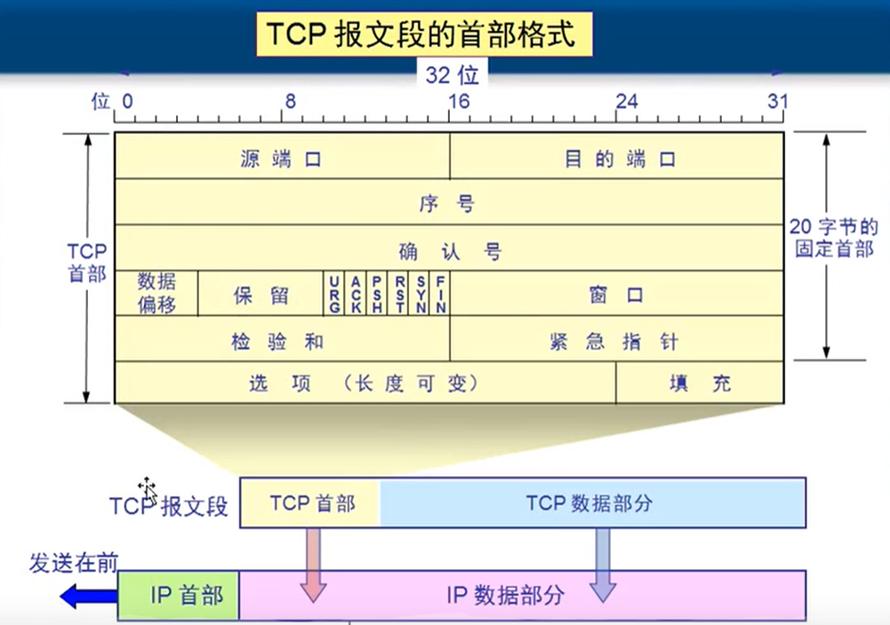
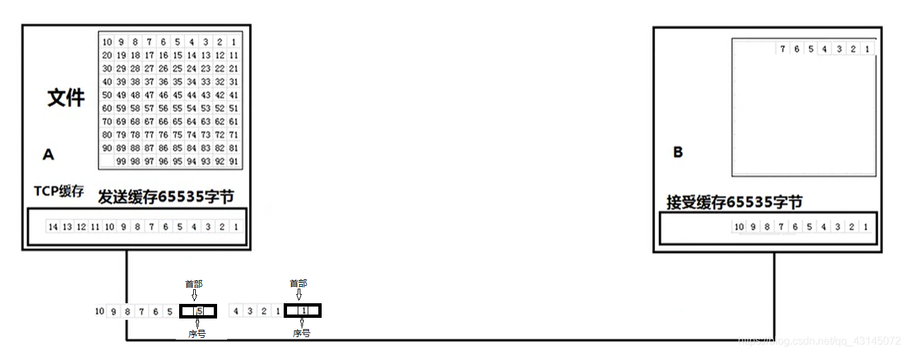
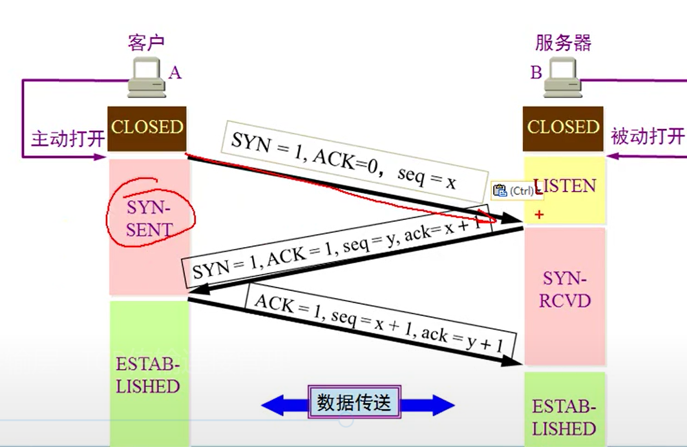
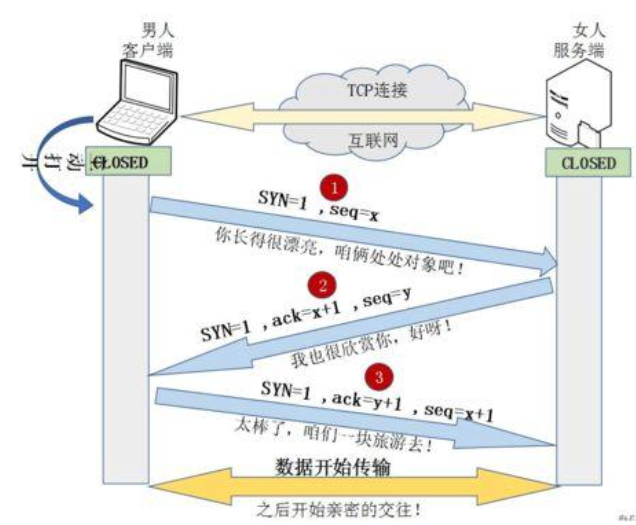
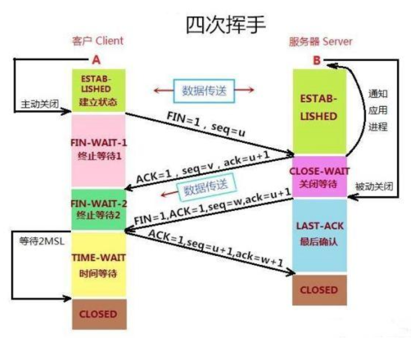
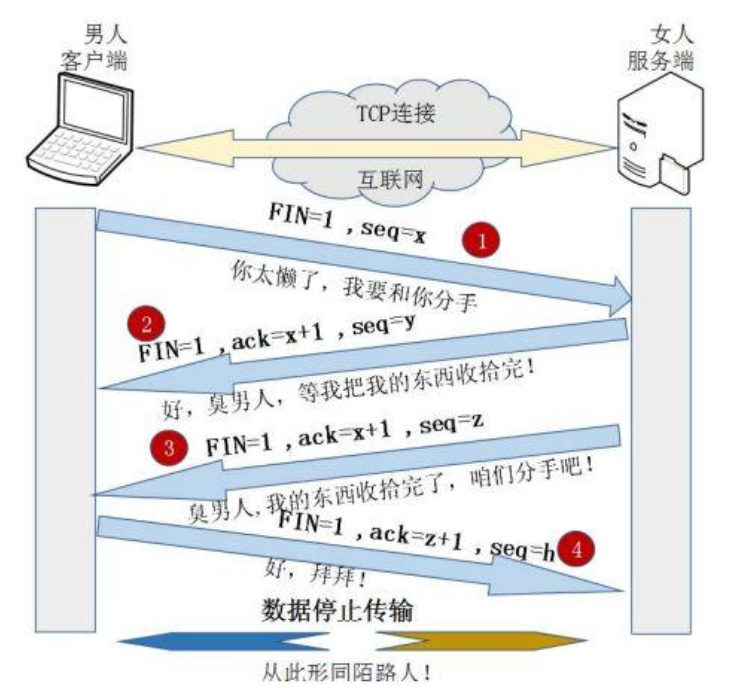

# TCP和UDP协议

# 一、TCP定义

维基百科：

**传输控制协议**（英语：**T**ransmission **C**ontrol **P**rotocol，缩写：**TCP**）是一种**面向连接**的、**可靠的**、基于[**字节流**](https://zh.wikipedia.org/wiki/%E5%AD%97%E7%AF%80%E6%B5%81)的[传输层](https://zh.wikipedia.org/wiki/%E4%BC%A0%E8%BE%93%E5%B1%82)通信协议。

关键字：面向连接，可靠，字节流。

- 面向连接：客户端、服务端交换数据前，需要建立连接；
- 可靠：通过特定机制，在不可靠的网络之上，确保报文准确送达，
- 字节流：数据的最小单位为字节。至于字节中存储内容的含义，由于应用层的程序决定。

# 二、TCP如何确保服务可靠性

TCP花了大量的功夫在确保传输层服务的可靠性上，具体举措包括（但不限于）以下：

- **应用数据切割**：应用数据被分隔成TCP认为最适合发送的多个报文段（由特定的算法和机制来确认）
- **接收端确认**：接收端收到报文段后，会向发送端发送确认报文；
- **超时重传机制**：发送端发送一个报文段后，会启动定时器，等待接收端确认收到这个报文；如果没有及时收到确认，发送端会重新发送报文；
- **数据校验和**：发送端发送的报文首部中，有个叫做校验和(checksum)的特殊字段，它是根据报文的首部、数据计算出来的。这是一个端到端的校验和，用来检测传输过程数据的变化。接收端收到报文后会对校验和进行检查，如果校验和存在差错，则丢弃这个报文，且不确认收到此报文（等待发送端超时重发）
- **报文段排序**：TCP报文包裹在IP数据包里进行传输，而IP数据包的到达次序是不固定的。接收端会对接收到的报文段重新排序，这个对应用层是无感知的；
- **去重复**：接收端丢弃重复的报文（比如，因某些原因，虽然接收端已经收到报文，且给发送端发送了接收确认，但接收端没有收到该确认，超时后重新发送了同样的报文）；
- **流量控制**：TCP连接双方都有固定大小的缓冲空间，且只允许发送端发送缓冲空间能够容纳的数据，避免缓冲区溢出；

# 三、TCP报文

TCP首部整体尺寸（必记）

- 固定：**20 字节**（普通快递单）
- 最大：**60 字节**（加备注、加加急等扩展）

**1. 源端口、目的端口（各 2 字节）**

- 源端口：**我是谁**（发件人门牌号）
- 目的端口：**发给谁**（收件人门牌号）作用：电脑同时开一堆软件，**精准把数据交给对应程序**。

**2. 序列号 SN（4 字节）【重中之重】**

白话：**这是第几号字节数据**TCP 把所有数据拆成无数个小字节，**每个字节都有唯一编号**。作用：

1. 乱序到达 → **按编号排序**
2. 重复收到 → **按编号去重**

**3. 确认号 ACK（4 字节）【重中之重】**

白话：**我已经收到前面所有数据，下一次我要「这个号」的数据**规则：**确认号 = 收到的最后一字节编号 + 1**是 TCP 可靠传输的核心回执。

**4. 数据偏移（4 位）**

白话：**这张快递单有多长**单位是 **4 字节**

- 值为 5 → 5×4=20 字节（标准最短首部）用来区分**快递单结束、真正数据开始**的位置。

**5. 6 个标志位（6 个开关，面试只考这 6 个）**

全是**布尔开关：0 关 1 开**

1. **SYN(synchronous)=1**：我要握手、建连接
2. **FIN(finsh)=1**：我说完了、要断开
3. **ACK(acknowledgement)=1**：这是确认回执（连接建立后**所有包都带 ACK**）
4. **RST(reset)=1**：连接炸了、强制重置
5. **PSH(push)=1**：别缓存，立刻交给应用
6. **URG(urgent)=1**：紧急数据，优先处理

**6. 窗口大小（2 字节）【流量控制核心】**

白话：**我现在还能收多少数据**接收方告诉发送方：我缓冲区还有空位，你**最多发这么多**。解决：发太快、收太慢溢出。

**7. 校验和**

白话：**验货码**路上数据损坏，直接丢弃重传。

**8. 紧急指针**

配合 URG 使用，标记紧急数据截止位置。

**9. 选项 + 填充**

- 选项：额外功能（时间戳、最大包大小）
- 填充：补 0 凑整齐，保证首部长度是 4 的倍数

⚠️注意：不要将确认序号Ack与标志位中的ACK搞混

# 四、三次握手和四次挥手

TCP的开始传输数据前，需要先建立连接。一旦数据传输完成，则需要断开连接。

## 4.1 三次握手建立连接

> 1）第一次握手：Client将标志位SYN(建立新连接)置为1，随机产生一个值seq=x，并将该数据包发送给Server，Client进入SYN_SENT状态，等待Server确认。
> 2）第二次握手：Server收到数据包后由标志位SYN=1知道Client请求建立连接，Server将标志位SYN和ACK(确认)都置为1，ack=x+1，随机产生一个值seq=y，并将该数据包发送给Client以确认连接请求，Server进入SYN_RCVD状态。
> 3）第三次握手：Client收到确认后，检查ack是否为x+1，ACK是否为1，如果正确则将标志位ACK置为1，ack=y+1，并将该数据包发送给Server，Server检查ack是否为y+1，ACK是否为1，如果正确则连接建立成功，Client和Server进入ESTABLISHED状态，完成三次握手，随后Client与Server之间可以开始传输数据了。

三次握手的通俗理解

## 4.2 四次挥手断开连接

> 1）第一次挥手：客户端向服务器发起请求释放连接的TCP报文，置FIN为1。客户端进入终止等待-1阶段。
> 2）第二次挥手：服务器端接收到从客户端发出的TCP报文之后，确认了客户端想要释放连接，服务器端进入CLOSE-WAIT阶段，并向客户端发送一段TCP报文。客户端收到后进入种植等待-2阶段。
>
> 3）第三次挥手：服务器做好了释放服务器端到客户端方向上的连接准备，再次向客户端发出一段TCP报文。。此时服务器进入最后确认阶段。
> 4）第四次挥手：客户端收到从服务器端发出的TCP报文，确认了服务器端已做好释放连接的准备，于是进入时间等待阶段，并向服务器端发送一段报文。注意：第四次挥手后客户端不会立即进入closed阶段，而是等待2MSL再关闭。

四次挥手的通俗理解

> 参考链接：
>
> [TCP入门与实例讲解 - 程序猿小卡 - 博客园](https://www.cnblogs.com/chyingp/p/understanding-tcp.html)
>
> [TCP/IP协议 （图解+秒懂+史上最全） - 技术自由圈 - 博客园](https://www.cnblogs.com/crazymakercircle/p/14499211.html)
>
> [【TCP通信】原理详解与编程实现（一）_如何使用tcp-CSDN博客](https://blog.csdn.net/qq_43145072/article/details/105565062)
>
> [TCP 协议简介 - 阮一峰的网络日志](https://www.ruanyifeng.com/blog/2017/06/tcp-protocol.html)